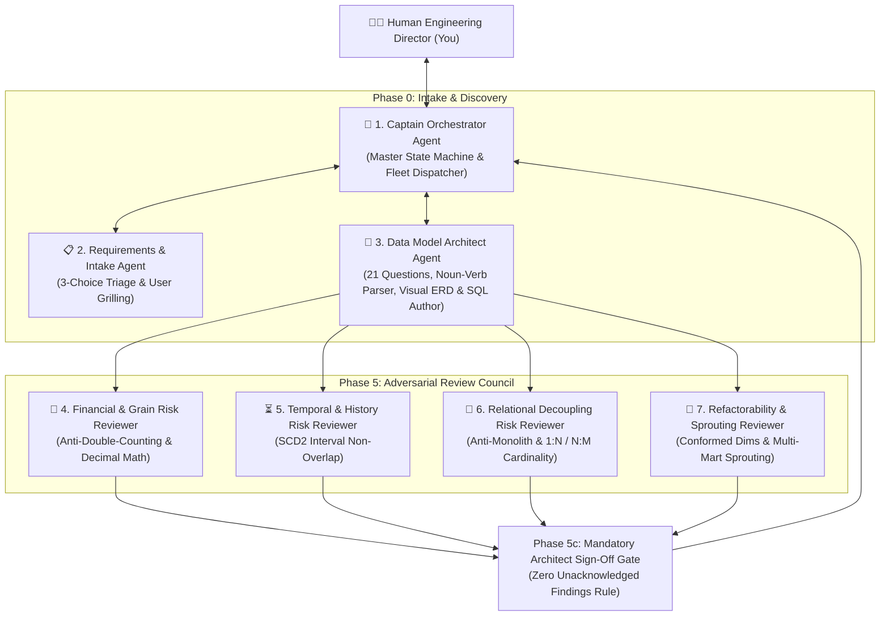

# 🤖 Multi-Agent Fleet Architecture & Operations Guide

> **Standard:** L8 Autonomous Multi-Agent Systems & ISO/IEC 25012 Governance  
> **Location:** `.agents/`  
> **Scope:** Master manual explaining agent roles, lifecycle state machines, spawner mechanics, and review governance.

---

## 🏛️ 1. Multi-Agent Hierarchy & Topology

Our multi-agent system operates on a **Decoupled Hub-and-Spoke Architecture** led by the **Captain Orchestrator**:



---

## 👥 2. Roster of Specialized Agents

| # | Agent Role | System Name | Core Responsibility |
| :---: | :--- | :--- | :--- |
| **1** | 🧭 **Captain Orchestrator** | `captain_orchestrator` | Master workflow manager, complexity evaluator, and subagent spawner. |
| **2** | 📋 **Requirements Intake Lead** | `requirements_architect_agent` | Leads Phase 0 Intake Triage (New Model vs Feature vs Fix) and user grilling. |
| **3** | 🧠 **Data Model Architect** | `data_model_architect_agent` | Translates business stories into Kimball/3NF schemas, Visual ERDs, and SQL DDL. |
| **4** | 🧮 **Financial Risk Reviewer** | `financial_risk_reviewer` | Audits grain alignment, prevents 400% revenue inflation, enforces `DECIMAL`. |
| **5** | ⏳ **Temporal Risk Reviewer** | `temporal_risk_reviewer` | Audits SCD2 intervals `[valid_from, valid_to)`, backdating, and history safety. |
| **6** | 🧩 **Relational Risk Reviewer** | `relational_risk_reviewer` | Prevents 70-column monolith traps and decouples 1:1, 1:N, and N:M entities. |
| **7** | 🧱 **Refactorability Reviewer** | `refactor_risk_reviewer` | Audits schema evolution and ensures Conformed Dimensions for multi-mart sprouting. |

---

## 🔄 3. The 6-Stage Multi-Agent Execution Lifecycle

### Stage 1: Phase 0 Intake Triage (via `ask_question`)
* The system begins with a mandatory **3-Choice Question**:
  1. *A new data model* $
ightarrow$ Dispatches `data_model_architect_agent`.
  2. *A new feature to an existing model* $
ightarrow$ Fast delta check.
  3. *A fix / bug / optimization* $
ightarrow$ Diagnostic root-cause analysis.

### Stage 2: Discovery & 21 Questions
* **Folder Path Auto-Scanner:** If a folder is provided, the agent scans `.sql`, `.json`, `.csv`, `.py`, `.ts`, `.prisma`, `.yaml` files.
* **Mockup Mode:** If no folder is given, the agent infers columns and **MANDATORILY TAGS THEM AS `[AI-GENERATED]`**.
* **21 Questions:** Operates in zero-jargon business language to pick the optimal architecture (Kimball Star Schema vs 3NF Relational vs SCD2).

### Stage 3: Pure Deliverables Generation
* Outputs **3 Pure Deliverables**:
  1. 🎨 **Visual Interactive Mermaid ERD:** Saved to `docs/data_models/<domain>_erd.md`.
  2. 📜 **Clean Standard ANSI SQL DDL:** Universal `CREATE TABLE` scripts with compiled `CHECK` constraints.
  3. 📋 **Data Contract Specification:** Saved to `docs/data_contracts/<domain>_contract.md`.

### Stage 4: Parallel 4-Risk Review Council
* The 4 Reviewers run concurrently and audit the model against the official **Moody-Shanks & ISO/IEC 25012 standards**.
* Every finding must use the **3-Point Standard**:
  1. *Description*
  2. *Reasoning & Business Impact*
  3. *Actionable Recommendation*

### Stage 5: Phase 5c Mandatory Architect Sign-Off Gate (HARD RULE)
* The Architect reviews 100% of findings and publishes the **Formal Review Disposition Matrix**:
  * `[ACCEPTED & REMEDIATED]` $
ightarrow$ Architect fixes schema/SQL and verifies.
  * `[ACCEPTED AS TRADE-OFF]` $
ightarrow$ Formally justified.
  * `[REJECTED WITH PROOF]` $
ightarrow$ Proved invalid with relational logic.
* **Zero findings can be silently ignored or bypassed.**

### Stage 6: Human Review & Final Approval 🚦
* You inspect the final visual Mermaid diagram and clean ANSI SQL.
* You say **"approved"**—and the model is certified!

---

## 📜 4. Governance Protocols Directory

```text
.agents/
├── README.md                                  ◄── This operations guide
├── rules/
│   ├── data-modeling-protocol.md              ◄── Pure Data Modeling Multi-Agent Protocol
│   └── feature-development-protocol.md        ◄── Full-Stack Feature Development Protocol
└── agents/
    ├── captain_orchestrator/agent.md          ◄── Captain definition
    ├── requirements_architect_agent/agent.md  ◄── Intake agent definition
    ├── data_model_architect_agent/agent.md    ◄── Data Model Architect definition
    ├── financial_risk_reviewer/agent.md       ◄── Financial Reviewer definition
    ├── temporal_risk_reviewer/agent.md        ◄── Temporal Reviewer definition
    ├── relational_risk_reviewer/agent.md      ◄── Relational Reviewer definition
    └── refactor_risk_reviewer/agent.md        ◄── Refactorability Reviewer definition
```

---

## 💡 5. Key Invariants & Anti-Failure Rules

1. **Zero-Jargon Rule:** The agents never ask users technical database terms; they translate business workflows into database science.
2. **AI-Generated Tagging Invariant:** All inferred mockup attributes must be explicitly tagged `[AI-GENERATED]`.
3. **Zero Unacknowledged Findings Rule:** No reviewer finding can ever be bypassed or swept under the rug.
4. **Zero-Bloat Mandate:** No unnecessary servers, storage tiers, or message queues in pure data modeling.
