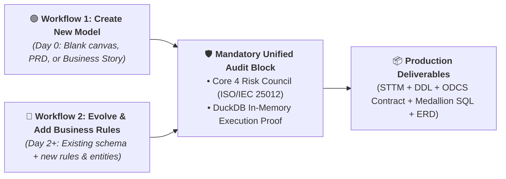
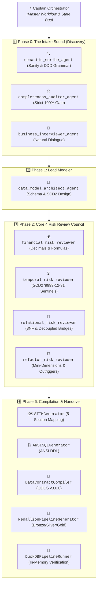

# 🏛️ Data Model Architect Studio

> Autonomous Multi-Agent AI System for Designing, Reviewing, and Certifying Enterprise Database Schemas, OpenDataContracts (ODCS v3.0.0), Standardized 5-Section STTM Documents, and Medallion SQL Pipelines.

---

## 📑 Table of Contents
1. [🚀 Quickstart](#-quickstart)
2. [🧭 How to Use the Studio](#-how-to-use-the-studio)
   - [🟢 Workflow 1: Create New Data Model (Day 0)](#1-workflow-1-create-new-data-model-day-0)
   - [🔵 Workflow 2: Evolve & Add Business Rules (Day 2+)](#2-workflow-2-evolve--add-business-rules-day-2)
3. [🛡️ The 8-Micro-Agent Fleet & Architecture](#️-the-8-micro-agent-fleet--architecture)
4. [📦 Deliverable Artifacts Specification](#-deliverable-artifacts-specification)
5. [🧪 Automated Testing & In-Memory DuckDB Verification](#-automated-testing--in-memory-duckdb-verification)
6. [🌐 Synchronized Repositories](#-synchronized-repositories)

---

## 🚀 Quickstart

### 1. Clone & Install Dependencies
```bash
git clone https://github.com/rachardv/data-model-architect.git
cd data-model-architect

# Create & activate virtual environment
python -m venv .venv
source .venv/bin/activate  # Or: .venv\Scripts\activate on Windows

# Install dependencies
pip install -r requirements.txt
```

### 2. Run 1-Click Verification Suite (37/37 Passing Tests)
```bash
# Windows
.\verify.ps1

# Linux / MacOS
./verify.sh

# Or directly via Pytest
python -m pytest tests/ -v
```

---

## 🧭 How to Use the Studio

The Studio operates on a clean **Dual-Workflow Architecture**:



---

### 1. Workflow 1: Create New Data Model (Day 0)
Use this workflow when you are starting from scratch with a new business idea, PRD, or user story.

#### Step A: Provide your raw business narrative in Python:
```python
from src.orchestration.captain import CaptainOrchestrator

captain = CaptainOrchestrator(output_dir="docs")

payload = {
    "domain": "ecommerce_retail",
    "narrative": "Customers visit our online store and purchase physical products using credit card or PayPal. We want to build executive dashboards to track daily gross revenue and top selling products over time."
}

result = captain.execute_workflow(payload)
```

#### Step B: The Phase 0 Intake Squad Evaluates Completeness:
1. 🔍 **`semantic_scribe_agent`:** Checks for sanity (no gibberish) and parses nouns & verbs.
2. ⚖️ **`completeness_auditor_agent`:** Evaluates the **5-Vector Metric** (Workload, Grain, History, Funnel, Multiplicity).
3. 🛑 **Strict 100% Hard Gate:** If score $< 100\%$, it **halts and returns targeted plain-English questions**:
   ```python
   if result["status"] == "INTAKE_INCOMPLETE_BLOCKED":
       print("Score:", result["completeness_score"])
       for q in result["questions"]:
           print(q["question"])
           print(q["options"])
   ```

#### Step C: Supply the Business Answers to Reach 100% Certification:
```python
payload["business_answers"] = [
    "Historical reports should preserve original customer address at time of purchase (SCD Type 2)."
]

# Re-run: Reaches 100.0% Completeness and automatically compiles all deliverables!
certified_result = captain.execute_workflow(payload)
print("Status:", certified_result["status"])  # CERTIFIED_PRODUCTION_READY
print("Architecture Pattern:", certified_result["architecture_pattern"])  # KIMBALL_STAR_SCD2
```

---

### 2. Workflow 2: Evolve & Add Business Rules (Day 2+)
Use this workflow when you **already have an existing schema** (`docs/schema.sql` or a dbt project) and want to:
* Layer on new validation rules (e.g. *"Premiums must be $\ge \$50.00$"*).
* Introduce new business entities (e.g. *"Assign orders to Logistics 3PL Carriers"*).
* Change a fact table to enable multi-stage lifecycle history (Accumulating Snapshot).

#### Step A: Submit your existing schema + new business rules:
```python
payload = {
    "branch": "ADD_BUSINESS_RULES",
    "domain": "ecommerce_retail",
    "existing_schema_path": "docs/schema.sql",
    "rules": [
        {
            "name": "min_order_threshold",
            "description": "Order total must be greater than zero",
            "definition": "order_amount_usd > 0.00",
            "action": "QUARANTINE"
        },
        {
            "name": "carrier_assignment",
            "description": "Every order must be assigned to a 3PL Logistics Carrier",
            "rule_text": "Assign each order to a Logistics Carrier entity with standard 1:1 carrier per order and SCD2 history."
        }
    ]
}

result = captain.execute_workflow(payload)
```

#### Step B: What the Agent Does Automatically:
1. **Kimball Entity Delta Detection:** Detects `carrier` is an unreferenced entity, creates `dim_carrier_scd2`, and adds `carrier_sk` to `fact_orders`.
2. **Hardens DDL:** Appends `CHECK (order_amount_usd > 0.00)` to `docs/schema.sql`.
3. **Generates Silver Quarantine View:** Generates `v_quarantine_orders` so invalid records in production are isolated without crashing downstream BI pipelines.
4. **Updates STTM:** Synchronizes [`docs/SOURCE_TO_TARGET_MAPPING.md`](docs/SOURCE_TO_TARGET_MAPPING.md) with the new carrier joins and rules.

---

## 🛡️ The 8-Micro-Agent Fleet & Architecture



---

## 📦 Deliverable Artifacts Specification

Every certified run automatically generates **5 enterprise-grade production deliverables**:

### 1. 🗺️ Standardized 5-Section STTM ([`docs/SOURCE_TO_TARGET_MAPPING.md`](docs/SOURCE_TO_TARGET_MAPPING.md))
* **Section 1: Short Description** (Business role and atomic grain).
* **Section 2: Source Tables** (Bronze landing tables and Silver staging models).
* **Section 3: Destination Table** (Gold target table and primary surrogate key).
* **Section 4: Raw SQL** (Production CTE transformation query).
* **Section 5: Column Mapping & Business Logic Matrix** (Column name, data type, nullable, plain-English description, and SQL transformation expression).

### 2. 🏗️ Clean ANSI SQL DDL ([`docs/schema.sql`](docs/schema.sql))
* 100% portable `CREATE TABLE` DDL scripts with primary keys, foreign keys, and hard database `CHECK` constraints.

### 3. 📜 OpenDataContract Standard v3.0.0 ([`docs/contract.yaml`](docs/contract.yaml))
* Industry-standard data contract specifying schema invariants, SLA freshness, and automated quarantine rules.

### 4. 🌊 Full Medallion Pipeline SQL ([`docs/pipelines/`](docs/pipelines/))
* **Bronze Layer:** Raw landing DDL with ingest audit timestamps.
* **Silver Layer:** Window deduplication CTEs and `v_quarantine_*` error views.
* **Gold Layer:** Incremental SCD2 merge queries and dimensional fact aggregations.

### 5. 🎨 Interactive Visual Mermaid ERD ([`docs/data_models/erd.md`](docs/data_models/erd.md))
* Rich, embedded Mermaid entity-relationship diagrams rendered directly in Markdown.

---

## 🧪 Automated Testing & In-Memory DuckDB Verification

The entire repository includes a comprehensive 37-test automated verification suite:

```bash
python -m pytest tests/ -v
```

### Test Coverage Highlights:
* 🧪 **`test_intake_engine.py`:** Tests low-entropy gibberish rejection (`"asdf"`), contradiction detection, and the Strict 100% Hard Gate circuit breaker.
* 🧪 **`test_spawner.py`:** Tests micro-agent registration and Intake Squad dispatch logs.
* 🧪 **`test_sttm_generator.py`:** Validates exact 5-section STTM document compliance.
* 🧪 **`test_duckdb_execution.py`:** Spawns an in-memory DuckDB database (`:memory:`) to execute Bronze DDL, Silver quarantine isolation, and Gold SCD2 merges in RAM.
* 🧪 **`test_benchmark_10_scenarios.py`:** Validates 10 ground-truth industry benchmarks (TPC-DS, Healthcare EHR, Commercial Lending, SaaS Churn, SOX HR).

---

## 🌐 Synchronized Repositories

* 🏢 **Organization Repo:** [https://github.com/synology-dev-projects/data-modeling-agent-system](https://github.com/synology-dev-projects/data-modeling-agent-system)
* 👤 **Personal Repo:** [https://github.com/rachardv/data-model-architect](https://github.com/rachardv/data-model-architect)
