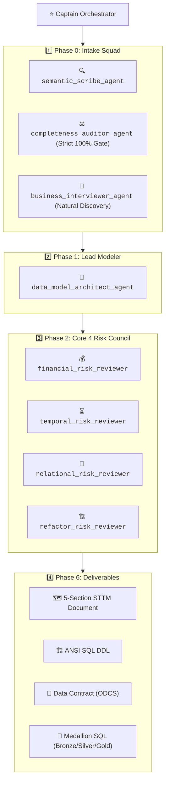

# 🏛️ Data Model Architect Studio

> Autonomous Multi-Agent System for Designing, Reviewing, and Certifying Enterprise Database Schemas, Visual Mermaid ERDs, OpenDataContracts (ODCS v3.0.0), Standardized 5-Section STTM Documents, and Medallion SQL Pipelines.

---

## 🚀 Quickstart (Ready Out of the Box)

### 1. Clone & Setup
```bash
git clone https://github.com/rachardv/data-model-architect.git
cd data-model-architect
python -m venv .venv
source .venv/bin/activate  # Or: .venv\Scripts\activate on Windows
pip install -r requirements.txt
```

### 2. Run Full Test Suite (37/37 Passing Tests)
```bash
python -m pytest tests/ -v
```

---

## 🌟 Key Architectural Capabilities

1. **🧭 Phase 0 Intake Squad (3 Micro-Agents):**
   * 🔍 `semantic_scribe_agent`: Pre-flight sanity gatekeeper & DDD noun-verb entity parser.
   * ⚖️ `completeness_auditor_agent`: Mathematical 5-vector completeness scorer enforcing the **Strict 100% Hard Gate**.
   * 💬 `business_interviewer_agent`: Consultative, 100% plain-English business discovery with zero technical database jargon.
2. **🛑 Strict 100% Information Completeness Hard Gate:**
   * Mathematically evaluates `workload_intent`, `entity_grain`, `temporal_policy`, `lifecycle_funnel`, and `relationship_multiplicity`.
   * **Strict Circuit Breaker:** Refuses to output SQL DDL or STTM specs until requirements reach 100.0%.
3. **🗺️ Standardized 5-Section STTM Generator (`docs/SOURCE_TO_TARGET_MAPPING.md`):**
   * Automatically compiles 5 structured sections per table: *Short Description, Source Tables, Destination Table, Raw SQL, and Column Mapping Matrix*.
4. **🎨 Visual Interactive Mermaid ERD:** Embedded diagrams rendered directly in Markdown.
5. **📜 OpenDataContract Standard (ODCS v3.0.0):** Formally codified schema invariants, SLAs, and database checks.
6. **⚡ Full Medallion Pipeline (Bronze → Silver → Gold):** Complete SQL pipelines with deduplication CTEs, Silver Quarantine error views, and Gold SCD2 merges.
7. **🦆 In-Memory DuckDB SQL Execution Engine:** 1-Click test execution validating pipelines in RAM.
8. **🧭 The Core 4 Risk Review Council:** Evaluates models against ISO/IEC 25012 and Moody-Shanks data quality frameworks.

---

## 🔄 Multi-Agent Fleet Hierarchy



---

## 📄 Standardized 5-Section STTM Document Format

```text
## 🏛️ [Table Name] (e.g. dim_customer_scd2 / fact_omnichannel_sales_lines)

### 1. Short Description
Concise business role, grain, and purpose.

### 2. Source Tables
List of upstream Bronze raw landing tables and Silver staging models.

### 3. Destination Table
Gold target table name, target layer, and primary key definition.

### 4. Raw SQL
Production CTE transformation query loading the target table.

### 5. Column Mapping & Business Logic Matrix
| Column Name | Data Type | Nullable? | Plain-English Description | SQL Expression / Transformation Logic |
```

---

## 🌐 Synchronized Repositories
* 🏢 **Organization Repo:** [https://github.com/synology-dev-projects/data-modeling-agent-system](https://github.com/synology-dev-projects/data-modeling-agent-system)
* 👤 **Personal Repo:** [https://github.com/rachardv/data-model-architect](https://github.com/rachardv/data-model-architect)
