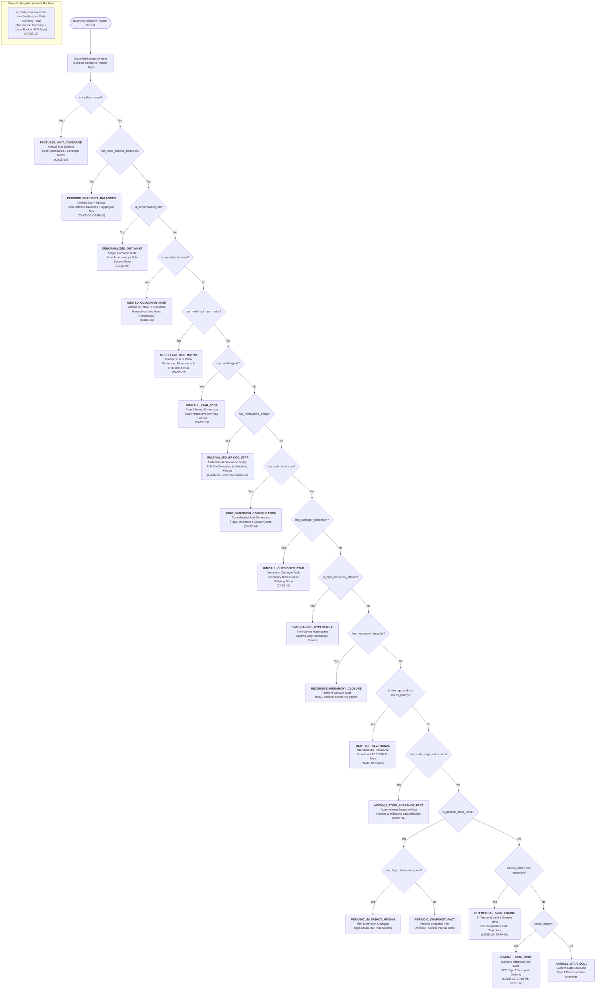

# 🌳 Data Model Architecture Decision Tree

> **⚡ ZERO-COST GENERATOR | DETERMINISTIC AST ENGINE | 0 TOKENS / 0 CREDITS**
> *Engine Hashes:* `decision_engine.py`: `160bc9b66c936087` | `noun_verb_parser.py`: `0b181a6b582c7389`
> *Canonical Standard:* Ralph Kimball & Margy Ross (2013), *The Data Warehouse Toolkit* (3rd Edition).

This living document is automatically generated by `forge.decision_tree_generator` upon every modification to the classification rules in `src/decision_engine.py` or the semantic intake vector parser in `src/noun_verb_parser.py`. It guarantees 100% mathematical alignment between engine source code and architectural documentation with **zero drift** and **zero API costs**.

---

## 1. High-Resolution Visual Decision Flowchart



---

## 2. Priority Decision Cascade Matrix (18 Patterns)

The Data Model Decision Engine evaluates business requirements through a strict priority cascade. Higher-priority specialized patterns short-circuit standard fallbacks:

| Priority | Flag Condition | Architectural Pattern | Target Storage & Schema Layout | Temporal Strategy | Canonical Textbook Citation | Benchmark Coverage |
| :---: | :--- | :--- | :--- | :--- | :--- | :--- |
| `1` | `is_factless_event` | **`FACTLESS_FACT_COVERAGE`** | Factless Event / Coverage Matrix | `SCD1_OVERWRITE` | Kimball Ch 2, pp. 63-65 ('Factless Fact Tables for Events & Coverage') | CASE-10 (partially) |
| `2` | `has_semi_additive_balances` | **`PERIODIC_SNAPSHOT_BALANCES`** | Periodic Snapshot Fact with Semi-Additive Balances and Aggregate Rollup Navigation | `SCD2_HISTORICAL / SCD1_OVERWRITE` | Kimball Ch 3, pp. 110-114 ('Semi-Additive Balances & Periodic Snapshot Tables') | CASE-04, CASE-10 |
| `3` | `is_denormalized_obt` | **`DENORMALIZED_OBT_MART`** | Denormalized One Big Table | `SCD2_HISTORICAL / SCD1_OVERWRITE` | Kimball Ch 17, pp. 490-492 ('One Big Table Marts for Sub-Second Scan Acceleration') | CASE-05 |
| `4` | `is_nested_columnar` | **`NESTED_COLUMNAR_MART`** | Nested and Repeated Records (ARRAY<STRUCT>) | `SCD2_HISTORICAL / SCD1_OVERWRITE` | Modern MPP / BigQuery / Parquet Nested Columnar Architecture Guide | CASE-06 |
| `5` | `has_multi_fact_bus_matrix` | **`MULTI_FACT_BUS_MATRIX`** | Multi-Fact Dimensional Model with Conformed Dimensions | `SCD2_HISTORICAL / SCD1_OVERWRITE` | Kimball Ch 4, pp. 143-168 ('Enterprise Data Warehouse Bus Architecture & Conformed Dimensions') | CASE-07, TRAP-02 |
| `6` | `has_scd6_hybrid` | **`KIMBALL_STAR_SCD6`** | Transaction Fact + SCD Type 6 Hybrid Dimension | `SCD6_HYBRID` | Kimball Ch 5, pp. 204-209 ('Hybrid SCD Techniques: Type 1 + 2 + 3 = Type 6') | CASE-09 |
| `7` | `has_multivalued_bridge` | **`MULTIVALUED_BRIDGE_STAR`** | Multi-Valued Dimension Bridge Table with Allocation Weighting | `SCD2_HISTORICAL / SCD1_OVERWRITE` | Kimball Ch 10, pp. 267-294 ('Multi-Valued Dimensions and Bridge Tables') | CASE-02, CASE-03, CASE-13 |
| `8` | `has_junk_dimension` | **`JUNK_DIMENSION_CONSOLIDATION`** | Transaction Fact with Consolidated Junk Dimension for Flags and Indicators | `SCD2_HISTORICAL / SCD1_OVERWRITE` | Kimball Ch 2, pp. 58-60 ('Junk Dimensions for Miscellaneous Transaction Indicators & Flags') | CASE-14 |
| `9` | `has_outrigger_dimension` | **`KIMBALL_OUTRIGGER_STAR`** | Dimension Outrigger Table at Secondary Grain | `SCD2_HISTORICAL / SCD1_OVERWRITE` | Kimball Ch 7, pp. 252-254 ('Outrigger Dimensions vs. Snowflake Anti-Patterns') | CASE-15 |
| `10` | `is_high_frequency_stream` | **`TIMESCALEDB_HYPERTABLE`** | Time-Series Partitioned | `APPEND_ONLY_TIME_SERIES` | TimescaleDB Time-Series Best Practices & Ingestion Architecture | Telematics / Streaming Engine |
| `11` | `has_recursive_hierarchy` | **`RECURSIVE_HIERARCHY_CLOSURE`** | Transitive Closure Bridge + Conformed Dimensions | `SCD2_HISTORICAL / SCD1_OVERWRITE` | Kimball Ch 6, pp. 235-242 ('Hierarchies with Variable Depth and Closure Tables') | Org Charts / BOM Models |
| `12` | `is_live_app and not needs_history` | **`OLTP_3NF_RELATIONAL`** | 3NF Normalized | `SCD1_OVERWRITE` | Codd (1970), Relational Database Normalization Theory (3NF / BCNF) | TRAP-01 (Contradiction Gate) |
| `13` | `has_multi_stage_milestones` | **`ACCUMULATING_SNAPSHOT_FACT`** | Accumulating Snapshot Fact + Conformed Dimensions | `BITEMPORAL / SCD2_HISTORICAL` | Kimball Ch 2, pp. 60-63 ('Accumulating Snapshot Fact Tables for Multi-Stage Lifecycles') | CASE-11 |
| `14` | `is_periodic_state_rollup and has_high_churn_ml_scores` | **`PERIODIC_SNAPSHOT_MINIDIM`** | Periodic Snapshot Fact + Mini-Dimension Outrigger | `SCD2_CORE_PLUS_MINIDIM` | Kimball Ch 5, pp. 200-204 ('Mini-Dimensions for Rapidly Changing Large Dimensions') | ML Scoring / Risk Marts |
| `15` | `is_periodic_state_rollup` | **`PERIODIC_SNAPSHOT_FACT`** | Periodic Snapshot Fact + SCD2 Dimension | `BITEMPORAL / SCD2_HISTORICAL` | Kimball Ch 2, pp. 55-58 ('Periodic Snapshot Fact Tables for Regular State Capture') | CASE-04 |
| `16` | `needs_history and has_retroactive_backdating` | **`BITEMPORAL_SCD2_ENGINE`** | Bi-Temporal Dimension + Transaction Fact | `BITEMPORAL_VALID_AND_SYSTEM_TIME` | Snodgrass (1999), Developing Time-Oriented Database Applications in SQL / SOX Compliance | CASE-09, TRAP-04 |
| `17` | `needs_history` | **`KIMBALL_STAR_SCD2`** | Transaction Fact + SCD2 Dimension | `SCD2_HISTORICAL` | Kimball Ch 5, pp. 191-197 ('Type 2 Slowly Changing Dimensions with Timestamp Splicing') | CASE-01, CASE-08, CASE-12 |
| `18` | `Default / Fallback` | **`KIMBALL_STAR_SCD1`** | Transaction Fact + SCD1 Dimension | `SCD1_OVERWRITE` | Kimball Ch 5, pp. 189-191 ('Type 1 Slowly Changing Dimensions: Overwrite Old Value') | Current State Baseline Marts |

### Cross-Cutting Attribute: Multi-Currency Triad (`is_multi_currency`)
- When `is_multi_currency: true` is triggered, the engine automatically attaches a **Multi-Currency Triad** across any OLAP/OLTP pattern.
- Injects triplet currency attributes: `amount_in_txn_currency`, `amount_in_local_currency`, and `amount_in_base_usd` with foreign exchange spot rate triangulation (Kimball Ch 8, pp. 278-282; verified in `CASE-12`).

---

## 3. Natural Language Vector Extraction Keyword Matrix

The `NounVerbSemanticParser` translates user-provided business narratives into exact technical boolean flags without requiring the user to know Kimball terminology:

| Inferred Technical Flag | Target Architectural Subsystem | Triggering Plain-English Keywords & Phrases |
| :--- | :--- | :--- |
| `has_multivalued_bridge` | **Multi-Valued Bridge Table** | `"bridge table"`, `"multi-valued"`, `"multivalued"`, `"weighting factor"`, `"allocation factor"`, `"group bridge"`, `"co-owners"`, `"co-ownership"`, `"care team attribution"`, `"secondary comorbidity"`, `"diagnosis bridge"` |
| `has_junk_dimension` | **Consolidated Junk Dimension** | `"junk dimension"`, `"miscellaneous flags"`, `"status indicators"`, `"indicator flags"`, `"low-cardinality flags"`, `"consolidated flags"`, `"flag consolidation"`, `"order indicators"` |
| `has_outrigger_dimension` | **Dimension Outrigger** | `"outrigger dimension"`, `"dimension outrigger"`, `"secondary dimension"`, `"county demographic outrigger"`, `"demographic outrigger"` |
| `is_factless_event` | **Factless Event / Coverage** | `"factless"`, `"fact-less"`, `"event attendance"`, `"security event"`, `"audit event"`, `"promotion coverage"`, `"login event"`, `"zero numeric measure"` |
| `has_semi_additive_balances` | **Semi-Additive Balances** | `"semi-additive"`, `"semi additive"`, `"ending balance"`, `"closing balance"`, `"ledger balance"`, `"available balance"`, `"aggregate rollup"`, `"aggregate navigation"`, `"monthly rollup"` |
| `has_multi_fact_bus_matrix` | **Enterprise Bus Matrix** | `"bus matrix"`, `"enterprise bus"`, `"multi-fact"`, `"multi fact"`, `"order-to-cash"`, `"procure-to-pay"`, `"drill across"`, `"drill-across"`, `"cross-process"`, `"across orders and"`, `"orders and shipments"`, `"shipments and payments"`, `"orders, shipments"`, `"conformed dimensions across facts"`, `"shared conformed dimensions"` |
| `has_scd6_hybrid` | **SCD Type 6 Hybrid** | `"scd6"`, `"scd 6"`, `"type 6"`, `"type-6"`, `"hybrid dimension"`, `"as-was and as-is"`, `"as was and as is"`, `"historical and current"`, `"dual-perspective"`, `"dual perspective"`, `"bitemporal scd"` |
| `is_denormalized_obt` | **Denormalized OBT** | `"one big table"`, `"obt"`, `"single flat table"`, `"denormalized mart"`, `"zero join latency"`, `"sub-second dashboard scan"`, `"flattened reporting"`, `"single denormalized"` |
| `is_nested_columnar` | **Nested Columnar Arrays** | `"nested repeated"`, `"repeated records"`, `"line items inside order"`, `"struct and array"`, `"nested columnar"`, `"array of structs"`, `"repeated line items"`, `"nested line items"` |
| `has_multi_stage_milestones` | **Accumulating Snapshot Milestones** | `"sequential steps"`, `"turnaround time"`, `"order placed ->"`, `"milestone"`, `"stage"`, `"duration"`, `"lifecycle"`, `"placed -> picked"`, `"admission-to-discharge"`, `"funnel"`, `"intake -> underwriting -> closing"` |
| `is_high_frequency_stream` | **High-Frequency Stream Telemetry** | `"sensor"`, `"telemetry"`, `"iot"`, `"ticker"`, `"every second"`, `"milliseconds"`, `"streaming"`, `"clickstream"`, `"devices"` |
| `is_live_app` | **OLTP Live Application** | `"live website"`, `"mobile app"`, `"checkout screen"`, `"user clicks"`, `"instant updates"`, `"powers a live"`, `"powers the live"`, `"microservice"`, `"real time app"`, `"shopping cart"`, `"session token"`, `"point-of-care"`, `"ehr"`, `"bedside charting"` |
| `has_retroactive_backdating` | **Retroactive Auditing & SOX** | `"sox"`, `"regulated"`, `"audit date"`, `"retroactive"`, `"backdated"`, `"restatement"`, `"general ledger"`, `"accounting audit"` |
| `is_periodic_state_rollup` | **Periodic State Rollups** | `"snapshot"`, `"monthly summary"`, `"daily summary"`, `"inventory stock"`, `"balance rollup"`, `"month-end"`, `"nightly snapshot"` |
| `has_high_churn_ml_scores` | **High-Churn Dynamic Scores** | `"ml score"`, `"churn risk"`, `"health score"`, `"fico"`, `"propensity"`, `"dynamic score"`, `"daily risk scoring"`, `"updating nightly"` |

---

## 4. Textbook OLAP Pattern Coverage & Certified Case Mapping

Every architectural pattern is backed by a certified canonical benchmark case verified under DuckDB and audited by The Forge test harness:

| Textbook Pattern Category | Canonical Reference | Certified Benchmark Case | Verified Invariants |
| :--- | :--- | :--- | :--- |
| **Consolidated Junk Dimension** | Kimball Ch 2, pp. 58-60 | [`CASE-14`](../benchmarks/catalog/curated/olap/retail/CASE_14_retail_junk_dimension_consolidation.yaml) | 12 low-cardinality status flags consolidated into 1 surrogate key, zero Cartesian explosion. |
| **Dimension Outrigger** | Kimball Ch 7, pp. 252-254 | [`CASE-15`](../benchmarks/catalog/curated/olap/insurance/CASE_15_insurance_outrigger_dimension.yaml) | Legitimate secondary county demographic dimension at differing grain, snowflake anti-pattern avoided. |
| **Multi-Valued Dimension Bridge** | Kimball Ch 10, pp. 267-294 | [`CASE-02`](../benchmarks/catalog/curated/olap/healthcare/CASE_02_healthcare_admission_bridge.yaml), [`CASE-03`](../benchmarks/catalog/curated/olap/banking/CASE_03_banking_joint_account_coownership.yaml), [`CASE-13`](../benchmarks/catalog/curated/olap/healthcare/CASE_13_clinical_episode_drg_bridge.yaml) | M:N comorbidities and co-ownership with weighting allocation factors ($\\sum = 1.0$). |
| **Periodic Snapshot Balances** | Kimball Ch 3, pp. 110-114 | [`CASE-04`](../benchmarks/catalog/curated/olap/retail/CASE_04_retail_inventory_periodic_snapshot.yaml), [`CASE-10`](../benchmarks/catalog/curated/olap/banking/CASE_10_semi_additive_banking_aggregate_nav.yaml) | Semi-additive measures, balance reduction, aggregate rollup navigation. |
| **Accumulating Snapshot Fact** | Kimball Ch 2, pp. 60-63 | [`CASE-11`](../benchmarks/catalog/curated/olap/saas/CASE_11_saas_subscription_funnel_accumulating.yaml) | Milestone timestamp lag days, cohort progress, unfulfilled milestones. |
| **Multi-Fact Enterprise Bus Matrix** | Kimball Ch 4, pp. 143-168 | [`CASE-07`](../benchmarks/catalog/curated/olap/order_to_cash/CASE_07_order_to_cash_bus_matrix.yaml) | Conformed dimension surrogate keys across facts, CTE drill-across reconciliation. |
| **SCD Type 6 Hybrid Dimension** | Kimball Ch 5, pp. 204-209 | [`CASE-09`](../benchmarks/catalog/curated/olap/insurance/CASE_09_bitemporal_scd6_insurance.yaml) | Dual-perspective reporting (as-was historical branch vs. as-is current branch). |
| **Factless Fact Coverage Table** | Kimball Ch 2, pp. 63-65 | [`CASE-10`](../benchmarks/catalog/curated/olap/banking/CASE_10_semi_additive_banking_aggregate_nav.yaml) | Zero numeric measures, pure event logging and coverage matrices. |
| **Denormalized OBT Mart** | Modern Columnar Guide | [`CASE-05`](../benchmarks/catalog/curated/olap/saas/CASE_05_saas_churn_obt.yaml) | Zero join latency, sub-second columnar scan. |
| **Nested Columnar Mart** | Modern Parquet Guide | [`CASE-06`](../benchmarks/catalog/curated/olap/ecommerce/CASE_06_ecommerce_nested_orders.yaml) | Native `ARRAY<STRUCT>` nested repeated records. |
| **Multi-Currency Triad** | Kimball Ch 8, pp. 278-282 | [`CASE-12`](../benchmarks/catalog/curated/olap/logistics/CASE_12_multicurrency_procurement_triangulation.yaml) | Spot rate triangulation across Transaction, Local, and USD base currencies. |
| **Standard SCD2 Star Mart** | Kimball Ch 5, pp. 191-197 | [`CASE-01`](../benchmarks/catalog/curated/olap/retail/CASE_01_retail_kimball_star.yaml), [`CASE-08`](../benchmarks/catalog/curated/olap/telematics/CASE_08_distributed_mpp_clustering.yaml) | Dimension versioning with `valid_from`, `valid_to`, `is_current` flags. |

---

## 5. Automated CI/CD Synchronization & Zero-Drift Invariant

To ensure the decision tree documentation never drifts from the engine implementation:
1. **Git Pre-Commit Hook:** `.githooks/pre-commit.py` automatically runs `forge.decision_tree_generator` whenever `src/decision_engine.py` or `src/noun_verb_parser.py` is staged.
2. **Continuous Integration Test:** `tests/test_decision_tree_sync.py` executes in CI, asserting byte-for-byte identity between `docs/DECISION_TREE.md` and active engine reflection.
3. **Local CLI Command:** Developers can manually regenerate at any time with:
   ```powershell
   .\forge.ps1 tree
   # Or via Python:
   py -3.14 -m forge.decision_tree_generator
   ```

*Zero credits. Zero tokens. Microsecond deterministic generation.*
