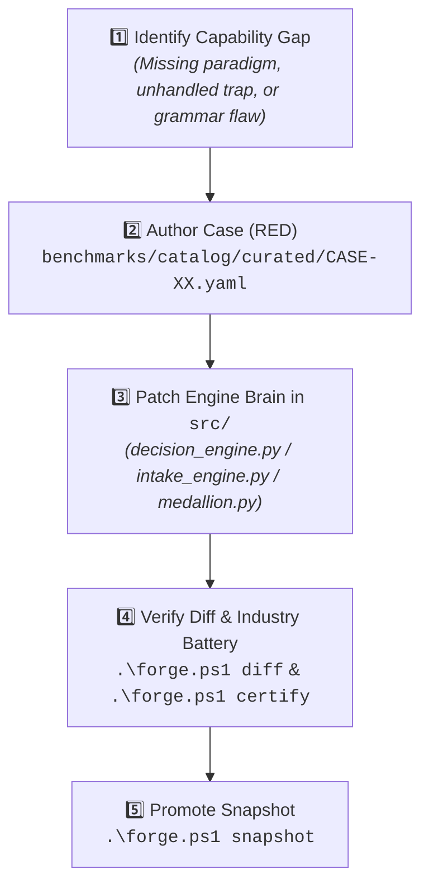

# 🛠️ The Forge Playbook: Modeler Engine Evolution Guide

This playbook defines the operating procedure for improving, tuning, refactoring, and certifying the **Data Model Architect Engine** (`src/`).

---

## 🚀 Quick Start with `forge.ps1`

Run commands directly from PowerShell:

```powershell
# 1. Run a single case in DuckDB
.\forge.ps1 test CASE-01

# 2. Check for schema drift and latency regressions against golden baseline
.\forge.ps1 diff

# 3. Strict CI check (exits 1 on unapproved schema changes or status flips)
.\forge.ps1 strict-diff

# 4. Run the full Forge Industry Certification battery (TPC-H, TPC-DI, SSB, Spider)
.\forge.ps1 certify

# 5. Run all 134+ pytest tests
.\forge.ps1 tests

# 6. Capture/promote current results as the new certified golden baseline
.\forge.ps1 snapshot

# 7. Run full end-to-end certification loop (tests -> strict-diff -> certify)
.\forge.ps1 all
```

---

## 🔄 The 5-Step Engine Improvement Loop



### Step 1: Identify the Gap
Find an architectural pattern or trap that the engine currently does not support.

### Step 2: Author a Ground-Truth Case (RED State)
Create `benchmarks/catalog/curated/CASE-XX_<slug>.yaml`.
Run `.\forge.ps1 test CASE-XX` to see the test fail or verify what the engine is missing.

### Step 3: Implement the Engine Patch (`src/`)
- Adjust intake parsing in `src/noun_verb_parser.py` or `src/intake_engine.py`.
- Adjust architecture selection in `src/decision_engine.py`.
- Adjust physical DDL / SQL in `src/medallion.py` or `src/sql_runner.py`.
Re-run `.\forge.ps1 test CASE-XX` until it passes with `PASS`.

### Step 4: Regression Diff & Certification
Run `.\forge.ps1 strict-diff` to mathematically prove you introduced zero schema drift across existing cases.
Run `.\forge.ps1 certify` to verify TPC and academic benchmarks.

### Step 5: Snapshot Promotion
Run `.\forge.ps1 snapshot` to update `benchmarks/baselines/golden_snapshot.json`.

---

---

## 🏛️ Root Directory Separation Architecture

The repository enforces a strict two-pillar architecture to support standalone binary packaging (`dma.exe`) for enterprise use without test fixture bloat:

```
data-model-architect/
├── src/                    # 🧠 Core Data Model Engine (Compiles to dma.exe)
│   ├── intake_engine.py    # Vector extraction & sanity filter
│   ├── decision_engine.py  # Dimensional architecture decision tree
│   ├── schema_author.py    # Dynamic schema specification author
│   ├── medallion_generator # Bronze/Silver/Gold SQL pipelines
│   ├── dbt_generator.py    # dbt Core repository generation
│   ├── sql_runner.py       # In-memory DuckDB runner
│   ├── cli.py              # Studio CLI (Compiler interface)
│   └── orchestration/      # Captain & Reviewer Council
│
└── forge/                  # 🛠️ The Forge Test Harness & Evaluation Suite
    ├── cli.py              # Dedicated Forge CLI (py -3.14 -m forge.cli)
    ├── runner.py           # Forge certification battery runner
    ├── snapshot_engine.py  # Golden snapshot & regression diffing
    ├── predefined_benchmark_gate.py # 1-by-1 case evaluation
    ├── catalog_loader.py   # YAML/JSON catalog discovery
    ├── industry_benchmarks # SSB, TPC-DS, TPC-DI, TPC-H suites
    ├── semantic_benchmarks # BIRD-SQL & Spider evaluation
    ├── mega_benchmark.py   # Academic stress-testing suite
    └── chaos_engine.py     # Zipfian skew & GDPR eraser
```

> [!IMPORTANT]
> **One-Way Architectural Invariant:** `forge/` may import from `src/`, but `src/` is strictly forbidden from importing anything from `forge/`. Production binaries compile purely from `src/`.

---

## 🛠️ How to Tweak This Workflow

1. **To tweak commands or add new steps:**
   - Edit [`forge.ps1`](file:///C:/Coding/VSCode/data-model-architect/forge.ps1).
2. **To tweak the AI Agent's instructions:**
   - Edit [`C:/Users/racha/.gemini/config/skills/forge/SKILL.md`](file:///C:/Users/racha/.gemini/config/skills/forge/SKILL.md).
3. **To adjust regression thresholds:**
   - Change `--latency-threshold` (default: `100.0%`) or `--baseline-path` in `forge.ps1` or `forge/cli.py`.
