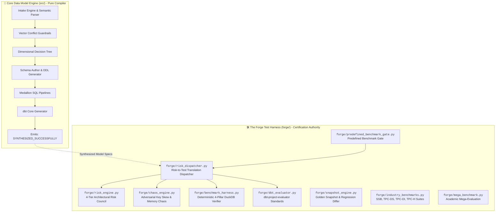

# 🛠️ The Forge Master Playbook: Architecture, Storage & Evolution SOP

This playbook defines the standardized architecture, storage layout, and **Standard Operating Procedures (SOP)** for evolving **The Forge** (`forge/`) and utilizing it to certify the **Core Data Model Engine** (`src/`).

---

## 🏛️ 1. High-Level Architecture & Separation of Concerns

The repository enforces a strict, two-pillar architecture:



### The 4 Hard Architectural Invariants
1. **One-Way Dependency Invariant:** `forge/` may import from `src/`, but `src/` is **strictly forbidden from importing anything from `forge/`**.
2. **Deterministic Isolation Invariant:** All physical tests in The Forge must execute against an isolated in-memory DuckDB connection (`test_con = duckdb.connect(":memory:")`) and cleanly release resources in a `finally:` block.
3. **Immutable Baseline Protocol:** Never edit `benchmarks/baselines/golden_snapshot.json` manually; snapshots are only recorded and promoted programmatically via `.\forge.ps1 snapshot`.
4. **Academic Provenance Rule:** Every ground-truth benchmark scenario or trap must cite an authoritative textbook, standard, or paper (Kimball, Inmon, TPC, BIRD-SQL).

---

## 📂 2. Storage & Component Organization Matrix

Every procedure, benchmark, risk rule, and artifact in The Forge has a dedicated, standardized location:

| Functional Layer | File / Directory Path | Key Procedures & Classes | Responsibility |
| :--- | :--- | :--- | :--- |
| **A. Declarative Catalogs** | [`benchmarks/catalog/curated/`](file:///C:/Coding/VSCode/data-model-architect/benchmarks/catalog/curated) | `CASE_01..04.yaml`, `TRAP_01..04.yaml` | Declarative, human-readable YAML benchmark scenarios and intentional traps with citations. |
| **B. Catalog Loader & Parser** | [`forge/catalog_loader.py`](file:///C:/Coding/VSCode/data-model-architect/forge/catalog_loader.py) | `BenchmarkCatalogLoader.load_from_directory()` | Discovers, parses, validates YAML/JSON against Pydantic models, and registers cases. |
| **C. Risk Council & Taxonomy** | [`forge/risk_engine.py`](file:///C:/Coding/VSCode/data-model-architect/forge/risk_engine.py) | `ValidationStrategyEngine.evaluate()`, `ValidationTier`, `RiskSeverity` | Inspects synthesized models for architectural hazards across 4 tiers (`RSK-01` to `RSK-08`). |
| **D. Risk-to-Test Dispatcher** | [`forge/risk_dispatcher.py`](file:///C:/Coding/VSCode/data-model-architect/forge/risk_dispatcher.py) | `RiskToTestDispatcher.evaluate_and_certify()` | Maps detected risks to targeted physical stress test batteries in DuckDB and awards `CERTIFIED_PRODUCTION_READY`. |
| **E. 4-Pillar DuckDB Verifier** | [`forge/benchmark_harness.py`](file:///C:/Coding/VSCode/data-model-architect/forge/benchmark_harness.py) | `ModelBenchmarkHarness.run_full_benchmark()` | Executes physical tests in DuckDB: Metric Conservation, Temporal Causality, Referential Integrity, and Hash-Join execution plans. |
| **F. Chaos & Adversarial Stress** | [`forge/chaos_engine.py`](file:///C:/Coding/VSCode/data-model-architect/forge/chaos_engine.py) | `AdversarialChaosGenerator` | Injects Zipfian 80/20 key skew under 16MB memory caps, out-of-order streams, and GDPR pseudonymization tests. |
| **G. dbt Structural Standards** | [`forge/dbt_evaluator.py`](file:///C:/Coding/VSCode/data-model-architect/forge/dbt_evaluator.py) | `DBTProjectEvaluator.evaluate_project()` | Audits compiled dbt repositories against industry standard structure (sources, models, docs, tests). |
| **H. Predefined Benchmark Gate** | [`forge/predefined_benchmark_gate.py`](file:///C:/Coding/VSCode/data-model-architect/forge/predefined_benchmark_gate.py) | `PredefinedBenchmarkGate.run_all_cases()` | Runs registered benchmark cases sequentially, executes custom SQL verification assertions, and coordinates certification. |
| **I. Decision Tracer & Audit** | [`forge/decision_tracer.py`](file:///C:/Coding/VSCode/data-model-architect/forge/decision_tracer.py)<br/>[`docs/benchmarks/traces/`](file:///C:/Coding/VSCode/data-model-architect/docs/benchmarks/traces) | `DecisionTracer.record_*()`, `finalize()` | Generates immutable, machine-readable JSON and human-readable Markdown traces for every evaluated case. |
| **J. Golden Baselines & Diffing** | [`benchmarks/baselines/golden_snapshot.json`](file:///C:/Coding/VSCode/data-model-architect/benchmarks/baselines/golden_snapshot.json)<br/>[`forge/snapshot_engine.py`](file:///C:/Coding/VSCode/data-model-architect/forge/snapshot_engine.py) | `SnapshotEngine.capture_snapshot()`, `diff_snapshots()` | Computes schema drift, column changes, key migrations, and latency regressions against the certified golden baseline. |
| **K. Industry & Academic Suites** | [`forge/industry_benchmarks.py`](file:///C:/Coding/VSCode/data-model-architect/forge/industry_benchmarks.py)<br/>[`forge/tpcdi_benchmark.py`](file:///C:/Coding/VSCode/data-model-architect/forge/tpcdi_benchmark.py)<br/>[`forge/semantic_benchmarks.py`](file:///C:/Coding/VSCode/data-model-architect/forge/semantic_benchmarks.py)<br/>[`forge/mega_benchmark.py`](file:///C:/Coding/VSCode/data-model-architect/forge/mega_benchmark.py) | SSB, TPC-DS, TPC-DI, TPC-H, BIRD-SQL, Spider | 200+ physical SQL test queries and parameterized cross-domain stress benchmarks. |
| **L. Execution Interfaces** | [`forge/cli.py`](file:///C:/Coding/VSCode/data-model-architect/forge/cli.py)<br/>[`forge.ps1`](file:///C:/Coding/VSCode/data-model-architect/forge.ps1) | PowerShell & Python CLIs | Developer control plane for running tests, strict diffs, snapshots, and certifications. |

---

## 🔄 3. Standard Operating Procedures (SOP) for Evolving The Forge

When evolving The Forge, follow the standardized procedure matching your objective:

### Procedure A: Adding a New Benchmark Scenario or Intentional Trap
*Use this when expanding coverage for a new business domain, data grain, or architectural edge case.*

1. **Create the YAML Case File:**
   - Add `benchmarks/catalog/curated/CASE_XX_<slug>.yaml` (for clean baselines) or `TRAP_XX_<slug>.yaml` (for intentional defensive halts).
   - Follow the standard YAML schema:
     ```yaml
     case_id: "CASE-05"
     name: "Enterprise Subscription Billing & Churn Analytics"
     domain: "saas_billing"
     hazard_category: "CLEAN_BASELINE" # or CONTRADICTION_HALT, CHASM_TRAP_FANOUT, CYCLIC_FK_LOOP, etc.
     is_intentional_trap: false
     expected_status: "CERTIFIED_PRODUCTION_READY" # or "AWAITING_ARCHITECTURAL_CONFIRMATION"
     citation: "Ralph Kimball & Margy Ross, The Data Warehouse Toolkit (3rd Edition), Chapter 14 (Accounting & Billing)"

     prompt: >
       SaaS subscription business tracking recurring monthly licenses, upgrades, and churn.

     business_answers:
       - "Analytics: Executive MRR, ARR, and cohort churn retention reporting"
       - "Grain: One row per subscription billing interval"
       - "Temporal: SCD Type 2 tracking on customer plan changes"
       - "Lifecycle: Discrete monthly billing events"
       - "Multiplicity: Standard 1:N account to subscriptions"

     verification_queries:
       - name: "Active Subscriptions Metric"
         query: "SELECT COUNT(*) FROM fact_saas_billing_orders"
         assertion_type: "scalar_gt"
         expected_value: 0
     ```
2. **Execute Single-Case Verification:**
   ```powershell
   .\forge.ps1 test CASE-05
   ```
3. **Inspect Regression Diff:**
   ```powershell
   .\forge.ps1 diff
   ```
4. **Promote into Golden Baseline:**
   ```powershell
   .\forge.ps1 snapshot
   ```

---

### Procedure B: Adding a New Architectural Risk (Expanding the Risk Council)
*Use this when teaching The Forge to detect a new architectural flaw, security vulnerability, or anti-pattern.*

1. **Define the Risk Rule in [`forge/risk_engine.py`](file:///C:/Coding/VSCode/data-model-architect/forge/risk_engine.py):**
   - Assign a new Risk ID (e.g., `RSK-09: DATA_MESH_INTERFACE_DRIFT`).
   - Assign a `ValidationTier` (Tier 1: Critical Blocker, Tier 2: High-Impact, Tier 3: Reliability, Tier 4: Polish).
   - Implement the detection heuristic inside `ValidationStrategyEngine.evaluate()`:
     ```python
     # Example: Rule RSK-09 - Missing Primary Key Constraint
     if not any(col.get("primary_key") for col in table.get("columns", [])):
         results.append(RiskResult(
             risk_id="RSK-09",
             tier=ValidationTier.TIER_2_HIGH_IMPACT,
             severity=RiskSeverity.HIGH,
             name="Missing Primary Key Definition",
             description=f"Table {table['name']} does not specify an explicit primary key.",
             mitigation="Add a surrogate BIGINT primary key or natural key constraint.",
             passed=False
         ))
     ```
2. **Add Unit Test in [`tests/test_validation_strategy.py`](file:///C:/Coding/VSCode/data-model-architect/tests/test_validation_strategy.py):**
   - Provide a flawed schema fixture and assert `RSK-09` is detected.
3. **Run Universal Tests:**
   ```powershell
   .\forge.ps1 tests
   ```

---

### Procedure C: Adding a Targeted Physical Stress Test Battery
*Use this when translating an architectural risk into a live SQL execution test in DuckDB.*

1. **Implement the Battery in [`forge/risk_dispatcher.py`](file:///C:/Coding/VSCode/data-model-architect/forge/risk_dispatcher.py):**
   - In `RiskToTestDispatcher.evaluate_and_certify()`, add the battery trigger:
     ```python
     # Battery H: Contract Drift Stress Test (RSK-09)
     if any(r["risk_id"] == "RSK-09" for r in risk_scorecard.get("results", [])):
         battery_status, details = cls._run_contract_stress_test(test_con, target_schema)
         executed_batteries.append({
             "battery": "CONTRACT_SCHEMA_VERIFICATION",
             "triggered_by_risk": "RSK-09",
             "status": battery_status,
             "details": details
         })
     ```
2. **If Adversarial Data Generation is Needed:**
   - Add generator methods in [`forge/chaos_engine.py`](file:///C:/Coding/VSCode/data-model-architect/forge/chaos_engine.py).
3. **Verify Isolated Execution:**
   - Ensure the battery executes against `test_con` and does not leak tables across runs.
4. **Run Full Diff & Certification:**
   ```powershell
   .\forge.ps1 strict-diff
   .\forge.ps1 certify
   ```

---

### Procedure D: Adding a New Industry Standards Suite
*Use this when integrating a new academic or industry benchmark standard (e.g., TPC-E or LDBC Graph).*

1. **Create the Benchmark Module:**
   - Create `forge/<standard>_benchmark.py` defining the suite class, schema specs, synthetic data loader, and SQL validation queries.
2. **Wire into Forge Runner:**
   - In [`forge/runner.py`](file:///C:/Coding/VSCode/data-model-architect/forge/runner.py), import and execute the new suite in `ForgeCertificationRunner.run_certification()`.
3. **Expose in Forge CLI & PowerShell Script:**
   - Update [`forge/cli.py`](file:///C:/Coding/VSCode/data-model-architect/forge/cli.py) and [`forge.ps1`](file:///C:/Coding/VSCode/data-model-architect/forge.ps1) with a new action or include it in `certify`.
4. **Benchmark Latency & SLA:**
   - Verify the suite completes within latency budgets (< 2 seconds total).

---

## ⚡ 4. Developer Command Quick Reference (`forge.ps1`)

| Command | Action | When to Use |
| :--- | :--- | :--- |
| `.\forge.ps1 list` | Lists all registered cases with academic citations | To view the catalog of active benchmarks and traps. |
| `.\forge.ps1 test <ID>` | Executes a single benchmark case in DuckDB | While authoring a new case or debugging an engine patch. |
| `.\forge.ps1 diff` | Compares current execution against golden baseline | To check schema drift and latency differences. |
| `.\forge.ps1 strict-diff` | Strict CI gate (exits 1 on unapproved drift) | Before committing code or in automated CI pipelines. |
| `.\forge.ps1 certify` | Runs the full 213+ check industry battery | To certify production readiness against TPC/SSB/BIRD standards. |
| `.\forge.ps1 tests` | Executes all 134+ pytest tests across repo | Universal test gate verifying zero regressions. |
| `.\forge.ps1 snapshot` | Promotes current results to golden baseline | After intentionally adding new cases or approving schema evolutions. |
| `.\forge.ps1 all` | Runs `tests` $\rightarrow$ `strict-diff` $\rightarrow$ `certify` in sequence | Complete pre-push validation battery. |
