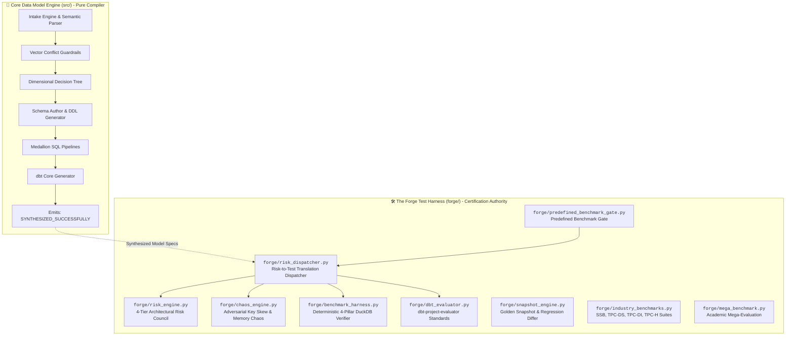

# 🛠️ The Forge Master Playbook: Architecture, Storage & Evolution SOP

This playbook defines the standardized architecture, storage layout, and **Standard Operating Procedures (SOP)** for evolving **The Forge** (`forge/`) and utilizing it to certify the **Core Data Model Engine** (`src/`).

---

## 🏛️ 1. High-Level Architecture & Separation of Concerns

The repository enforces a strict, two-pillar architecture:



### The 4 Hard Architectural Invariants
1. **One-Way Dependency Invariant:** `forge/` may import from `src/`, but `src/` is **strictly forbidden from importing anything from `forge/`**.
2. **Deterministic Isolation Invariant:** All physical tests in The Forge must execute against an isolated in-memory DuckDB connection (`test_con = duckdb.connect(":memory:")`) and cleanly release resources in a `finally:` block.
3. **Immutable Baseline Protocol:** Never edit `benchmarks/baselines/golden_snapshot.json` manually; snapshots are only recorded and promoted programmatically via `.\forge.ps1 snapshot`.
4. **Academic Provenance Rule:** Every ground-truth benchmark scenario or trap must cite an authoritative textbook, standard, or paper (Kimball, Inmon, TPC, BIRD-SQL).

---

## 📂 2. Storage & Component Organization Matrix

Every procedure, benchmark, risk rule, and artifact in The Forge has a dedicated, standardized location:

| Functional Layer | File / Directory Path | Key Procedures & Classes | Responsibility |
| :--- | :--- | :--- | :--- |
| **A. Declarative Catalogs** | [`benchmarks/catalog/curated/`](file:///C:/Coding/VSCode/data-model-architect/benchmarks/catalog/curated) | `CASE_01..19.yaml`, `TRAP_01..04.yaml` | Hierarchically organized by `<workload>/<domain>/` (`olap/`, `traps/`). Filterable via `--workload` and `--domain`. |
| **B. Catalog Loader & Parser** | [`forge/catalog_loader.py`](file:///C:/Coding/VSCode/data-model-architect/forge/catalog_loader.py) | `BenchmarkCatalogLoader.load_from_directory()` | Discovers, parses, validates YAML/JSON against Pydantic models, and registers cases. |
| **C. Risk Council & Taxonomy** | [`forge/risk_engine.py`](file:///C:/Coding/VSCode/data-model-architect/forge/risk_engine.py) | `ValidationStrategyEngine.evaluate()`, `ValidationTier`, `RiskSeverity` | Inspects synthesized models for architectural hazards across 4 tiers (`RSK-01` to `RSK-14`). |
| **D. Risk-to-Test Dispatcher** | [`forge/risk_dispatcher.py`](file:///C:/Coding/VSCode/data-model-architect/forge/risk_dispatcher.py) | `RiskToTestDispatcher.evaluate_and_certify()` | Maps detected risks to targeted physical stress test batteries in DuckDB and awards `CERTIFIED_PRODUCTION_READY`. |
| **E. 4-Pillar DuckDB Verifier** | [`forge/benchmark_harness.py`](file:///C:/Coding/VSCode/data-model-architect/forge/benchmark_harness.py) | `ModelBenchmarkHarness.run_full_benchmark()` | Executes physical tests in DuckDB: Metric Conservation, Temporal Causality, Referential Integrity, and Hash-Join execution plans. |
| **F. Chaos & Adversarial Stress** | [`forge/chaos_engine.py`](file:///C:/Coding/VSCode/data-model-architect/forge/chaos_engine.py) | `AdversarialChaosGenerator` | Injects Zipfian 80/20 key skew, join fan-out checks (factor <= 1.0), and GDPR pseudonymization tests. |
| **G. dbt Structural Standards** | [`forge/dbt_evaluator.py`](file:///C:/Coding/VSCode/data-model-architect/forge/dbt_evaluator.py) | `DBTProjectEvaluator.evaluate_project()` | Audits compiled dbt repositories against industry standard structure (sources, models, docs, tests). |
| **H. Predefined Benchmark Gate** | [`forge/predefined_benchmark_gate.py`](file:///C:/Coding/VSCode/data-model-architect/forge/predefined_benchmark_gate.py) | `PredefinedBenchmarkGate.run_all_cases()` | Runs registered benchmark cases sequentially, executes custom SQL verification assertions, and coordinates certification. |
| **I. Decision Tracer & Audit** | [`forge/decision_tracer.py`](file:///C:/Coding/VSCode/data-model-architect/forge/decision_tracer.py)<br/>[`docs/benchmarks/traces/`](file:///C:/Coding/VSCode/data-model-architect/docs/benchmarks/traces) | `DecisionTracer.record_*()`, `finalize()` | Generates immutable, machine-readable JSON and human-readable Markdown traces for every evaluated case. |
| **J. Golden Baselines & Diffing** | [`benchmarks/baselines/golden_snapshot.json`](file:///C:/Coding/VSCode/data-model-architect/benchmarks/baselines/golden_snapshot.json)<br/>[`forge/snapshot_engine.py`](file:///C:/Coding/VSCode/data-model-architect/forge/snapshot_engine.py) | `SnapshotEngine.capture_snapshot()`, `diff_snapshots()` | Computes schema drift, column changes, key migrations, and latency regressions against the certified golden baseline. |
| **K. Decision Tree & Documentation** | [`forge/decision_tree_generator.py`](file:///C:/Coding/VSCode/data-model-architect/forge/decision_tree_generator.py)<br/>[`docs/DECISION_TREE.md`](file:///C:/Coding/VSCode/data-model-architect/docs/DECISION_TREE.md) | `DecisionTreeGenerator.sync_docs()` | Deterministic zero-credit AST reflection generator producing full Mermaid decision flowcharts and 22-pattern matrices in <30ms. |
| **L. Industry & Academic Suites** | [`forge/industry_benchmarks.py`](file:///C:/Coding/VSCode/data-model-architect/forge/industry_benchmarks.py)<br/>[`forge/tpcdi_benchmark.py`](file:///C:/Coding/VSCode/data-model-architect/forge/tpcdi_benchmark.py)<br/>[`forge/semantic_benchmarks.py`](file:///C:/Coding/VSCode/data-model-architect/forge/semantic_benchmarks.py)<br/>[`forge/mega_benchmark.py`](file:///C:/Coding/VSCode/data-model-architect/forge/mega_benchmark.py) | SSB, TPC-DS, TPC-DI, TPC-H, BIRD-SQL, Spider | 200+ physical SQL test queries and parameterized cross-domain stress benchmarks. |
| **M. Execution Interfaces** | [`forge/cli.py`](file:///C:/Coding/VSCode/data-model-architect/forge/cli.py)<br/>[`forge.ps1`](file:///C:/Coding/VSCode/data-model-architect/forge.ps1) | PowerShell & Python CLIs | Developer control plane for running tests, strict diffs, snapshots, tree docs, and certifications. |

---

## 🔄 3. Standard Operating Procedures (SOP) & The Anti-Bloat Protocol

> [!IMPORTANT]
> **Mandatory Pre-Flight Anti-Bloat Gate:** Before adding any benchmark, risk rule, battery, or probe to The Forge, you **MUST** consult [`docs/RISK_TAXONOMY.md`](file:///C:/Coding/VSCode/data-model-architect/docs/RISK_TAXONOMY.md). Check the Master Risk Registry to verify that the hazard is not already covered, and follow the Intake Decision Matrix to identify the single correct process.

### Process A: Adding Standardized Benchmarks & Scenarios (Domain Coverage Risk)
*Protects against:* **Category 1: Domain Coverage & Semantic Competence Risk** (e.g. paradigm blindness, grain misattribution, contradictory requirements).
*Scope:* All **schema-specific** benchmarks (curated YAML cases in `benchmarks/catalog/curated/<workload>/<domain>/` + standardized suites like TPC-DS, TPC-DI, SSB, TPC-H, BIRD-SQL).

1. **Anti-Bloat Check:** Confirm that the business domain, entity topology, or grain pattern is not already covered by `CASE-01` through `CASE-19` or `TRAP-01` through `TRAP-04`.
2. **Create the YAML Case File in Nested Directory:**
   - Add `benchmarks/catalog/curated/<workload>/<domain>/CASE_XX_<slug>.yaml` (for clean baselines) or `benchmarks/catalog/curated/traps/<domain>/TRAP_XX_<slug>.yaml` (for intentional defensive halts).
   - Author standard schema with mandatory `citation`, `workload_type`, `prompt`, `business_answers`, and `verification_queries`.
3. **Execute Single-Case Verification & Filtering:**
   ```powershell
   .\forge.ps1 test CASE-XX
   .\forge.ps1 list -Workload olap -Domain saas
   py -3.14 -m forge.cli --list-cases --workload olap --domain retail
   ```
4. **Inspect Regression Diff & Promote Golden Baseline:**
   ```powershell
   .\forge.ps1 diff
   .\forge.ps1 snapshot
   ```

---

### Process B: Adding Architectural Risk Sensors (Structural Defect Risk)
*Protects against:* **Category 2: Structural & Architectural Defect Risk** (e.g. cyclic foreign key deadlocks, chasm trap structures, missing surrogate keys, unprotected PII).
*Scope:* Pure static syntax, AST, and DAG linting in [`forge/risk_engine.py`](file:///C:/Coding/VSCode/data-model-architect/forge/risk_engine.py).

1. **Anti-Bloat Check:** Ensure this check runs in $O(V+E)$ graph time purely from schema metadata without booting DuckDB or running SQL. If it needs SQL, it belongs in Process C or D.
2. **Define the Risk Rule in [`forge/risk_engine.py`](file:///C:/Coding/VSCode/data-model-architect/forge/risk_engine.py):**
   - Assign a new Risk ID (`RSK-XX`), `ValidationTier` (1-4), and `RiskSeverity`.
   - Implement the inspection heuristic inside `ValidationStrategyEngine.evaluate()`.
3. **Add Unit Test in [`tests/test_validation_strategy.py`](file:///C:/Coding/VSCode/data-model-architect/tests/test_validation_strategy.py):**
   - Provide a flawed schema fixture and assert `RSK-XX` is flagged.
4. **Run Universal Tests:**
   ```powershell
   .\forge.ps1 tests
   ```

---

### Process C: Adding Physical Stress Test Batteries (Computational Stress Risk)
*Protects against:* **Category 3: Computational & Hardware Stress Risk** (e.g. Zipfian 80/20 key skew, join fan-out inflation > 1.0, temporal stream jitter, GDPR Art. 17 cascades).
*Scope:* Targeted DuckDB hardware stress batteries in [`forge/risk_dispatcher.py`](file:///C:/Coding/VSCode/data-model-architect/forge/risk_dispatcher.py) and [`forge/chaos_engine.py`](file:///C:/Coding/VSCode/data-model-architect/forge/chaos_engine.py).

1. **Anti-Bloat Check:** Batteries in Process C are **not** run on every model; they are dynamically triggered by specific risk findings emitted by Process B. Ensure you are not re-testing a universal physical law (which belongs in Process D).
2. **Implement the Battery in [`forge/risk_dispatcher.py`](file:///C:/Coding/VSCode/data-model-architect/forge/risk_dispatcher.py):**
   - In `RiskToTestDispatcher.evaluate_and_certify()`, add the battery trigger mapped to `RSK-XX`.
   - Ensure the battery executes against isolated `test_con = duckdb.connect(":memory:")` and releases cleanly.
3. **Run Full Diff & Certification:**
   ```powershell
   .\forge.ps1 strict-diff
   .\forge.ps1 certify
   ```

---

### Process D: Adding Universal Schema-Agnostic Mathematical Probes (Universal Invariant Risk)
*Protects against:* **Category 4: Universal Mathematical Invariant Risk** (e.g. metric conservation drift, point-in-time causality violations, foreign key orphan leaks, Cartesian plan blowouts).
*Scope:* 100% schema-agnostic probes in [`forge/benchmark_harness.py`](file:///C:/Coding/VSCode/data-model-architect/forge/benchmark_harness.py).

1. **Anti-Bloat Check (HARD INVARIANT):** Process D probes are **strictly forbidden from hardcoding table or column names**. The probe must discover fact tables by numeric columns and dimension tables by surrogate keys using dynamic reflection (`information_schema`).
2. **Implement the Universal Probe in [`forge/benchmark_harness.py`](file:///C:/Coding/VSCode/data-model-architect/forge/benchmark_harness.py):**
   - Add the probe method executing reflection queries on DuckDB.
   - Assert the mathematical invariant (e.g. $|\sum Raw - \sum Mart| == 0.0000$).
3. **Verify Zero Regressions Across Full Suite:**
   ```powershell
   .\forge.ps1 tests
   .\forge.ps1 certify
   ```

---

## ⚡ 4. Developer Command Quick Reference (`forge.ps1`)

| Command | Action | When to Use |
| :--- | :--- | :--- |
| `.\forge.ps1 fast` | Runs core unit tests + 14-case regression diff (~10s) | **Recommended inner-loop command** while iterating on `staging`. |
| `.\forge.ps1 promote` | Runs full 219 checks + 144 tests, merges `staging` $\rightarrow$ `main`, and pushes | To promote and release fully certified changes from `staging` to `main`. |
| `.\forge.ps1 test <ID>` | Executes a single benchmark case in DuckDB | While authoring a new case or debugging an engine patch. |
| `.\forge.ps1 diff` | Compares current execution against golden baseline | To check schema drift and latency differences. |
| `.\forge.ps1 strict-diff` | Strict CI gate (exits 1 on unapproved drift) | Before committing code or in automated CI pipelines. |
| `.\forge.ps1 certify` | Runs the full 219-check industry battery | To certify production readiness against TPC/SSB/BIRD standards. |
| `.\forge.ps1 tests` | Executes all 144+ pytest tests across repo | Universal test gate verifying zero regressions. |
| `.\forge.ps1 snapshot` | Promotes current results to golden baseline | After intentionally adding new cases or approving schema evolutions. |
| `.\forge.ps1 all` | Runs `tests` $\rightarrow$ `strict-diff` $\rightarrow$ `certify` in sequence | Complete pre-push validation battery. |
| `.\forge.ps1 list` | Lists all registered cases with academic citations | To view the catalog of active benchmarks and traps. |
| `.\forge.ps1 -v` | Enables verbose stdout JSON streaming | When debugging intermediate pipeline steps. |

---

## 📝 5. Autonomous Failure Logging Protocol

Whenever any Forge benchmark, test suite, or verification check (`.\forge.ps1 test`, `.\forge.ps1 diff`, `.\forge.ps1 certify`, `forge.cli`, or `pytest`) fails:

1. **Mandatory Failure Log Structure:**
   - **The Failure:** The exact test case, command, assertion, or metric that failed.
   - **The Why (Root Cause):** The mechanical/technical error, metric drift, or AST rule violated.
   - **The Remedy & General Reasoning:** The surgical resolution applied and why that architectural fix preserves system invariants.
2. **Autonomous Remediation Invariant:**
   - The failure log and reasoning are documented directly in the trajectory / artifact without blocking for user approval.
   - The agent remediates immediately, re-verifies with the appropriate test suite, and proves 100% resolution with zero regressions.

### Incident History Log

| Timestamp (UTC) | Component / Test | The Failure | The Why (Root Cause) | The Remedy & Reasoning | Status |
| :--- | :--- | :--- | :--- | :--- | :---: |
| `2026-09-23T18:57:49Z` | `test_validation_strategy.py::test_captain_executes_validation_strategy_in_workflow` | `cert['status'] == 'RISK_VALIDATION_FAILED'` | Battery K in `forge/risk_dispatcher.py` rejected non-blocking advisory `WARNING` status emitted by `RSK-13` for basic SCD2 dimension without `is_inferred`. | 1) Scoped Battery K status to only fail on `FAIL` / `HALT`.<br>2) Scoped `RSK-13` ghost key warning to late-arriving / SCD6 intents.<br>3) Added `is_inferred` column to standard SCD2 synthesizer in `schema_author.py`. | **RESOLVED (100% Pass)** |
| `2026-09-23T18:59:09Z` | `.\forge.ps1 test CASE-09` | `Binder Error: Values list "source" does not have a column named "customer_sk"` | `src/medallion_generator.py` entered customer-specific MERGE logic for any dimension with `has_scd2`, referencing non-existent `customer_sk` on policy dimension. | 1) Scoped customer SCD2 merge in `medallion_generator.py` to customer dimensions.<br>2) Added temporal interval seed generation for non-customer SCD dimensions.<br>3) Added generic surrogate key handling to fact incremental loader.<br>4) Filtered benchmark claim assertions to `claim_id >= 80001`. | **RESOLVED (100% Pass)** |
| `2026-09-23T19:30:07Z` | `test_validation_strategy.py::test_rsk14_metric_additivity_and_rollup_linter` | `StopIteration` on `RSK-14` result | `RSK-01` halted early due to `Granularity Ambiguity in table 'fact_daily_account_balances'`: test fixture schema omitted `primary_key` and `grain` on mock fact table. | Added `primary_key: "snapshot_id"` and `grain: "daily account balance snapshot"` to test fixture table specifications. | **RESOLVED (100% Pass)** |
| `2026-09-23T19:30:38Z` | `test_validation_strategy.py::test_rsk14_metric_additivity_and_rollup_linter` | `StopIteration` on `RSK-14` result | `RSK-12` halted early due to `MPP Partitioning Blindspot`: test fixture mock fact tables omitted `partition_by`. | Added `partition_by: "snapshot_date_key"` and `partition_by: "event_date_key"` to mock fact tables in test fixture. | **RESOLVED (100% Pass)** |
| `2026-09-23T19:32:15Z` | `.\forge.ps1 certify` / `tests/test_semantic_benchmarks.py` | `SPIDER-BANKING-01` failed with classification mismatch (`PERIODIC_SNAPSHOT_BALANCES` != `PERIODIC_SNAPSHOT_FACT`) | `has_semi_additive_balances` parser regex in `src/noun_verb_parser.py` included overly broad keyword `"account balance"`, hijacking generic periodic snapshot banking scenarios. | Scoped `has_semi_additive_balances` to explicit semi-additive and rollup terms (`"semi-additive"`, `"ending balance"`, `"closing balance"`, `"aggregate rollup"`, etc.), leaving generic balance narratives to standard periodic snapshots. | **RESOLVED (100% Pass)** |
| `2026-09-23T20:25:37Z` | `benchmarks/catalog/curated/` / `docs/DECISION_TREE.md` | Decision tree coverage gap on Kimball Junk Dimensions & Outriggers; manual docs drift risk. | Decision engine lacked explicit short-circuits for consolidated junk dimensions (`JUNK_DIMENSION_CONSOLIDATION`), dimension outriggers (`KIMBALL_OUTRIGGER_STAR`), and multi-valued bridges (`MULTIVALUED_BRIDGE_STAR`). | 1) Added 3 textbook patterns to `src/decision_engine.py` & semantic parser keywords.<br>2) Authored `CASE-14` (Retail Junk Dim) & `CASE-15` (Insurance Outrigger Dim).<br>3) Built zero-cost deterministic AST generator `forge/decision_tree_generator.py` (<1ms, 0 credits).<br>4) Enforced zero drift via `tests/test_decision_tree_sync.py` and git pre-commit hook. | **RESOLVED (100% Pass)** |

---

## 🌿 6. Two-Tier Branch Lifecycle & Verification Governance

The repository operates a strict, two-tier branch governance policy designed to maximize development velocity while enforcing zero defect escape into `main`:

```mermaid
flowchart LR
    subgraph STAGING["🌿 staging Branch (Inner Loop)"]
        DEV["Active Coding & Refactoring"] --> FAST["⚡ .\\forge.ps1 fast (~10s)<br/>(Core Tests + 19-Case Strict Diff)"]
        FAST -->|Iterate rapidly| DEV
    end

    subgraph PROMOTION["🚀 Atomic Promotion Gate"]
        FAST -->|All checks green| PROMOTE["Run: .\\forge.ps1 promote"]
        PROMOTE --> FULL_TEST["1. Full 144 Pytest Suite"]
        FULL_TEST --> STRICT_DIFF["2. 19-Case Golden Strict Diff"]
        STRICT_DIFF --> CERTIFY["3. Full 219 Industry Certification"]
        CERTIFY --> MERGE["4. Fast-Forward Merge staging -> main"]
        MERGE --> PUSH["5. Dual Push to origin & synology"]
    end

    subgraph MAIN["🛡️ main Branch (Certified Production Release)"]
        PUSH --> PROD["100% Certified Baseline on main"]
    end
```



### Invariant A: Branch Purpose & Isolation
1. **`staging` (Development & Experimentation):** All new features, bug fixes, schema enhancements, and risk rules are committed on `staging`. Verification on `staging` relies on `.\forge.ps1 fast` (<12 seconds), avoiding redundant long-running industry suites.
2. **`main` (Certified Production Baseline):** Code is **never committed directly to `main`**. Promotion to `main` strictly requires running `.\forge.ps1 promote`, which executes all 219 industry checks and 144 pytest unit tests before merging and synchronizing both remotes.

### Invariant B: Quiet on Success, Loud on Failure (Automatic Error Burst)
1. **Context Window Token Economy:** By default, `$env:DATA_MODEL_LOG_LEVEL = "WARNING"` suppresses intermediate JSON stdout streaming during successful test runs, keeping the AI assistant's context window clean and conserving API credits.
2. **Loud on Failure:** On any exit code $\neq$ 0, Python and pytest automatically burst the complete failure stack trace and the exact failing SQL query directly to `stdout`.
3. **Trace Persistence:** Full JSON and Markdown execution traces are **always written to disk** in `docs/benchmarks/traces/*.json` and `*.md` regardless of terminal verbosity.
4. **Verbose Override:** Developers can pass `-v` or `-VerboseMode` to `.\forge.ps1` to re-enable verbose debug output.

### Invariant C: Graph Architecture Policy (Strict YAGNI)
1. **No Runtime Graph Frameworks:** The test runner is strictly linear, deterministic, and fail-fast. No dynamic DAG execution engines (e.g. LangGraph or Airflow test runners) are permitted in `forge/`.
2. **Declarative Visuals:** Graph visualization is maintained strictly via declarative Mermaid diagrams in documentation and markdown traces, ensuring high human/LLM readability with zero runtime performance cost.


