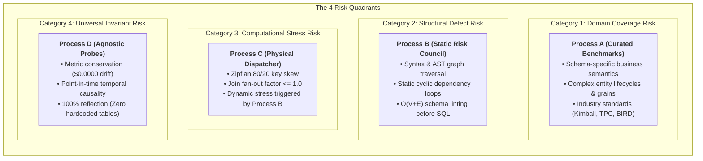
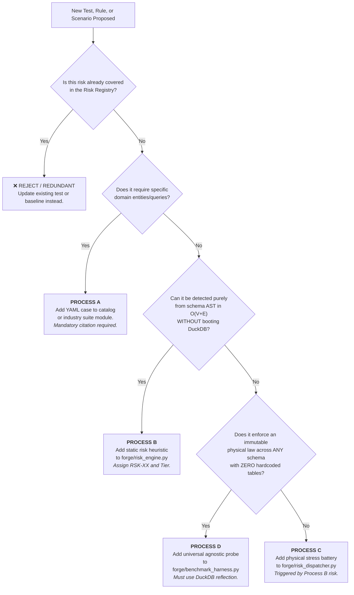

# 🛡️ Anti-Bloat Risk Taxonomy & Intake Decision Matrix

This document defines the formal **Anti-Bloat Risk Taxonomy** for `data-model-architect`. It maps every risk to one of the **4 Forge Processes (A, B, C, D)** and establishes a deterministic **Intake Decision Matrix** to ensure that new tests, benchmarks, risk rules, and probes expand coverage without redundancy or architectural bloat.

---

## 🏛️ 1. The 4 Risk Quadrants & Process Ownership

To prevent overlapping test suites and redundant validation layers, all hazards and failure modes are strictly partitioned into **4 mutually exclusive risk categories**:

---

### Category 1: Domain Coverage & Semantic Competence Risk (Process A)
* **Definition:** The risk that the compiler encounters a business domain, grain, or entity lifecycle pattern it does not know how to model, causing it to collapse grains, hallucinate relationships, or generate an invalid dimensional topology.
* **Owned by:** **Process A** (`benchmarks/catalog/curated/` + Industry Suites in `forge/industry_benchmarks.py`).
* **What it protects against:**
  - **Paradigm Blindness:** Inability to model specific real-world industry designs (e.g. SaaS recurring subscription MRR/ARR, healthcare encounter-to-diagnosis bridge groups, banking joint account multi-ownership, periodic inventory snapshots).
  - **Grain Misattribution:** Collapsing a line-item transaction grain into an order-header snapshot, losing transaction-level detail.
  - **Business Requirement Contradictions:** Requesting millisecond write-heavy OLTP while the engine attempts an analytical star mart.
* **Core Characteristics:**
  - **Schema-Specific:** Case files define their own explicit entities, column contracts, and domain verification queries.
  - **Academic Provenance:** Every case must cite an authoritative textbook, specification, or paper (Kimball, Inmon, Adamson, TPC, BIRD-SQL).
* **Anti-Bloat Exclusion Rule:**
  > [!CAUTION]
  > **DO NOT** add a new case to Process A if the entity relationship, cardinality (1:1, 1:N, M:N), and temporal grain are already represented in `CASE-01` through `CASE-04` or `TRAP-01` through `TRAP-04`. Adding another "e-commerce retail" case when `CASE-01` already tests Kimball retail star schemas is **bloat**. Only add when a distinct business lifecycle or entity topology is missing.

---

### Category 2: Structural & Architectural Defect Risk (Process B)
* **Definition:** The risk that the synthesized schema AST or table dependency DAG contains latent architectural antipatterns, security vulnerabilities, or unoptimized topological structures *before running a single line of SQL*.
* **Owned by:** **Process B** (`forge/risk_engine.py`).
* **What it protects against:**
  - **Cyclic Foreign Key Graphs:** Table A $\rightarrow$ Table B $\rightarrow$ Table A causing circular compilation deadlocks or recursive infinite loops (`RSK-05`).
  - **Chasm / Multi-Fact Fan-Out Topology:** Detecting disparate grain fact tables wired directly to shared dimensions without proper bridge/mart isolation (`RSK-02`).
  - **Missing Identity & Key Constraints:** Tables compiled without surrogate primary keys or cluster keys.
  - **Unprotected PII & Compliance Leaks:** Column names matching sensitive patterns (`ssn`, `credit_card`, `dob`) without explicit masking tags (`RSK-08`).
  - **Lineage Blast Radius:** Schema breaking changes that silently drop or rename columns relied on by downstream consumers (`RSK-09`).
* **Core Characteristics:**
  - **Pure Static AST & DAG Inspection:** Runs in memory in $O(V+E)$ graph traversal time without executing database queries or booting DuckDB.
  - **Zero Database Dependency:** Pure deterministic python analysis over table metadata.
* **Anti-Bloat Exclusion Rule:**
  > [!CAUTION]
  > **DO NOT** add a rule to Process B if it requires executing queries, measuring runtimes, or verifying data calculations. Process B is strictly a static syntax/graph inspector. If the rule cannot be evaluated in $O(V+E)$ purely from schema metadata, it belongs in Process C or Process D.

---

### Category 3: Computational & Hardware Stress Risk (Process C)
* **Definition:** The risk that a structurally sound schema fails during physical query execution under adverse hardware constraints, extreme key skew, out-of-order event arrival, or data mutation.
* **Owned by:** **Process C** (`forge/risk_dispatcher.py` + `forge/chaos_engine.py`).
* **What it protects against:**
  - **Workload Efficiency & Join Fan-Out Inflation:** Heavy 80/20 key skew causing unconstrained Cartesian row multiplication rather than factor $\le 1.0$ (`RSK-06`).
  - **Partition & Cluster Pruning Deficiencies:** High-frequency event/transaction tables missing cluster/partition keys.
  - **Out-of-Order Temporal Jitter:** Late-arriving facts arriving with irregular timestamp offsets breaking incremental window loads.
  - **GDPR Art. 17 Pseudonymization Cascades:** Erasing or pseudonymizing customer records breaking referential integrity or zeroing out financial ledger aggregates (`RSK-08`).
* **Core Characteristics:**
  - **Targeted Dynamic Dispatch:** Batteries in Process C are **not** run indiscriminately; they are dynamically triggered by specific risk findings emitted by Process B.
  - **Adversarial Hardware Stress:** Pushes DuckDB into constrained execution states (restricted memory caps, synthetic chaos generators).
* **Anti-Bloat Exclusion Rule:**
  > [!CAUTION]
  > **DO NOT** add a stress test to Process C if it tests a universal physical law (e.g. penny balancing) that applies to all data models equally. Process C is reserved for **adversarial physical stress** (skew, memory, jitter, erasure) mapped directly to a detected architectural risk.

---

### Category 4: Universal Mathematical Invariant Risk (Process D)
* **Definition:** The risk that a data model violates the fundamental, non-negotiable physical laws of dimensional and relational modeling (conservation of mass, temporal causality, and set theory), regardless of domain or table names.
* **Owned by:** **Process D** (`forge/benchmark_harness.py` Agnostic Probes).
* **What it protects against:**
  - **The Law of Metric Conservation ($\sum \text{Raw} \equiv \sum \text{Mart}$):** Multi-fact join inflation or Cartesian fan-out where financial revenue or units are multiplied by $2\times - 10\times$ ($0.0000$ drift allowed).
  - **The Law of Temporal Causality (Point-in-Time Invariant):** Late-arriving events joining to future or present dimension states rather than the state active at transaction time (`is_current = TRUE` amnesia).
  - **The Law of Referential & Grain Integrity:** Dirty natural keys or foreign key orphans escaping Silver quarantine and corrupting Gold analytics.
  - **Primary Key Uniqueness:** Natural key or grain duplication across base tables.
  - **Execution Plan Invariants:** Cartesian cross-product execution plans; ensuring physical hash joins complete in $<100\text{ms}$.
* **Core Characteristics:**
  - **100% Schema-Agnostic via Reflection:** Inspects table structures dynamically using DuckDB `information_schema`.
  - **Zero Hardcoded Table Names:** **Strictly forbidden** from referencing specific names like `orders` or `fact_sales`. Probes identify facts by numeric measures and dimensions by surrogate keys.
* **Anti-Bloat Exclusion Rule:**
  > [!CAUTION]
  > **DO NOT** add a probe to Process D that references specific domain tables or business logic. If a probe needs `WHERE order_status = 'COMPLETED'`, it is **not** an agnostic probe—it is a domain-specific query and belongs in Process A.

---

## 🚦 2. The Anti-Bloat Intake Decision Matrix

Before creating any new file or adding code to The Forge, follow this decision tree to determine where it belongs or whether it should be rejected as redundant:

---

## 📋 3. Master Risk Registry & Coverage Matrix

Every active risk profile in the system must be mapped to its owning process, category, and anti-bloat exclusion criteria:

| Risk ID | Hazard / Risk Name | Owning Process | Risk Category | Detection Mechanism | Existing Coverage | Anti-Bloat Exclusion Rule |
| :--- | :--- | :---: | :--- | :--- | :--- | :--- |
| `RSK-01` | Semantic Inversion Trap (OLTP vs OLAP) | **A & B** | Domain Coverage / Structural | Tier 1 Intake Vector Gate + Static Workload Classifier | `TRAP-01`, `IntakeEngine` | Do NOT add OLTP vs OLAP tests for other domains; `TRAP-01` already validates compile-time contradiction halts. |
| `RSK-02` | Chasm & Fan-Out Trap (Static AST) | **B** | Structural Defect | Static AST 1:N join detector | `TRAP-02`, `forge/risk_engine.py` | Traps disparate grain joins statically. Do not run SQL here. |
| `RSK-02-DYNAMIC` | Metric Conservation Proof ($\sum Raw \equiv \sum Mart$) | **D** | Universal Invariant | Battery A: Physical DuckDB aggregate assertion down to $0.0000$ drift | `forge/risk_dispatcher.py`, `forge/benchmark_harness.py` | Do NOT write manual SQL summing columns in custom cases; Process D automatically probes all numeric facts. |
| `RSK-03` | Temporal Causality Leakage (Timeline Bleed) | **D** | Universal Invariant | Universal SCD2 Point-in-Time Join Probe (`9999-12-31` sentinel) | `TRAP-04`, `forge/benchmark_harness.py` | Do NOT hardcode date joins in new benchmarks to test PIT causality; Process D validates time intervals dynamically. |
| `RSK-04` | Referential Orphan & Quarantine Leakage | **D** | Universal Invariant | Agnostic Foreign Key Integrity Probe & Silver Quarantine Isolation | `forge/benchmark_harness.py` | Do NOT create separate unit tests for foreign key orphans on every new table; Process D probes FK reflection globally. |
| `RSK-05` | Cyclic Foreign Key Loops & Recursive Traps | **B** | Structural Defect | Static DFS cycle detection over schema foreign key graph | `TRAP-03`, `forge/risk_engine.py` | Do NOT boot DuckDB to detect cyclic dependency deadlocks; Process B traps graph cycles statically in $O(V+E)$. |
| `RSK-05-DYNAMIC` | Physical Hash-Join EXPLAIN Plan Proof | **D** | Universal Invariant | Battery D: EXPLAIN plan inspection ensuring sub-100ms hash joins | `forge/risk_dispatcher.py`, `forge/benchmark_harness.py` | Do NOT write ad-hoc query plan checks; Process D verifies hash join efficiency across all queries. |
| `RSK-06` | Workload Efficiency & Join Fan-Out Stability | **C** | Computational Stress | Dynamic Battery E: Zipfian 80/20 Key Skew Join Fan-Out Verification (Factor $\le 1.0$) | `forge/chaos_engine.py`, `forge/risk_dispatcher.py` | Proves zero intermediate row explosion ($Factor \le 1.0$) under skewed foreign keys. |
| `RSK-07` | Requirement Volatility & Grain Collapse | **A** | Domain Coverage | Intake Atomic Grain Pushback & Lowest Atomic Grain Verification | `CASE-04`, `IntakeEngine` | Do NOT add snapshot models without lowest atomic grain base facts preserved. |
| `RSK-08` | GDPR Art. 17 PII Detection & Tagging | **B** | Structural Defect | Static PII Pattern Classifier | `forge/risk_engine.py` | Do NOT add ad-hoc regex checks for PII in pipeline tests; register PII patterns in `RSK-08` static evaluator. |
| `RSK-08-DYNAMIC` | GDPR Pseudonymization Sentinel & Zero-Orphan Proof | **C** | Computational Stress | Battery G: Physical data redaction & zero-orphan fact ledger check | `forge/risk_dispatcher.py`, `forge/chaos_engine.py` | Process C proves compliance without foreign key orphan corruption under data deletion. |
| `RSK-09` | Lineage Blast Radius & Breaking Changes | **B** | Structural Defect | Column-Level Lineage Linter & Semantic Versioning View Linter | `forge/risk_engine.py` | Do NOT create manual schema diff scripts; use `SnapshotEngine` and `RSK-09` AST comparison. |
| `RSK-10` | OLAP Workload & Query Hop Alignment | **B & C** | Structural Defect / Computational | AST query hop depth validator (0 hops for OBT, unnest for Nested) & Battery H dispatch | `forge/risk_engine.py`, `forge/risk_dispatcher.py` | Enforces zero join latency for OBT and array unnesting for nested columnar schemas. |
| `RSK-11` | Enterprise Bus Matrix Conformance & Chasm Prevention | **B & C** | Structural Defect / Computational | AST shared dimension key conformance, Chasm trap direct join detection & Battery I dispatch | `forge/risk_engine.py`, `forge/risk_dispatcher.py` | Enforces shared conformed surrogate keys across multiple facts and CTE-based Drill-Across reporting. |
| `CASE-01` | Retail Kimball Star Mart Baseline | **A** | Domain Coverage | Curated YAML benchmark verifying conformed dimensions & sales facts | `benchmarks/catalog/curated/CASE_01_retail_kimball_star.yaml` | Covers single-source e-commerce retail. Do NOT add another e-commerce case unless it introduces a fundamentally new grain. |
| `CASE-02` | Healthcare Encounter-to-Diagnosis Bridge | **A** | Domain Coverage | Curated YAML benchmark verifying M:N bridge tables & group weighting | `benchmarks/catalog/curated/CASE_02_healthcare_admission_bridge.yaml` | Covers M:N multi-valued bridge table patterns with allocation factors. |
| `CASE-03` | Banking Joint Account Multi-Owner Bridge | **A** | Domain Coverage | Curated YAML benchmark verifying multi-party account co-ownership | `benchmarks/catalog/curated/CASE_03_banking_joint_account_coownership.yaml` | Covers recursive role-playing entities and dual ownership accounting. |
| `CASE-04` | Inventory Periodic Daily Snapshot | **A** | Domain Coverage | Curated YAML benchmark verifying semi-additive periodic snapshots | `benchmarks/catalog/curated/CASE_04_retail_inventory_periodic_snapshot.yaml` | Covers semi-additive measures and periodic daily balance snapshots. |
| `CASE-05` | SaaS Subscription Renewal Cohort OBT | **A** | Domain Coverage | Curated YAML benchmark verifying denormalized One Big Table (OBT) flat marts | `benchmarks/catalog/curated/CASE_05_saas_churn_obt.yaml` | Covers zero-join OBT flat schemas for sub-second analytical dashboarding. |
| `CASE-06` | E-Commerce Orders with Nested Repeated Line Items | **A** | Domain Coverage | Curated YAML benchmark verifying nested repeated records (ARRAY<STRUCT>) | `benchmarks/catalog/curated/CASE_06_ecommerce_nested_orders.yaml` | Covers modern columnar nested arrays eliminating join fan-out traps. |
| `CASE-07` | Enterprise Order-to-Cash Bus Matrix | **A** | Domain Coverage | Curated YAML benchmark verifying multi-fact value streams, conformed dimensions, and drill-across reconciliation | `benchmarks/catalog/curated/CASE_07_order_to_cash_bus_matrix.yaml` | Covers cross-process Order-to-Cash lifecycle facts sharing conformed customer, product, and date dimensions. |
| `TRAP-01` | Contradiction Guardrail Trap | **A** | Domain Coverage | Intentional trap proving engine refuses to synthesize contradictory prompts | `benchmarks/catalog/curated/TRAP_01_contradiction.yaml` | Covers OLTP low-latency CRUD vs OLAP warehouse conflict. |
| `TRAP-02` | Multi-Fact Chasm Trap Fanout | **A** | Domain Coverage | Intentional trap proving engine refuses to cross disparate grain facts | `benchmarks/catalog/curated/TRAP_02_chasm_trap.yaml` | Covers shared dimension fan-out across unlinked fact tables. |
| `TRAP-03` | Cyclic FK Dependency Loop | **A** | Domain Coverage | Intentional trap proving engine halts on circular relational cycles | `benchmarks/catalog/curated/TRAP_03_cyclic_graph.yaml` | Covers circular references in entity hierarchies. |
| `TRAP-04` | SCD2 Historical Amnesia Point-in-Time Trap | **A** | Domain Coverage | Intentional trap proving engine rejects unversioned slowly changing dimensions | `benchmarks/catalog/curated/TRAP_04_scd2_amnesia.yaml` | Covers late-arriving dimension changes and historical attribution loss. |
| `TPC-DS` | Enterprise Decision Support Suite (99 queries) | **A** | Domain Coverage / Industry Standard | Standard multi-dimensional catalog stress battery | `forge/industry_benchmarks.py` | Covers full-scale enterprise retail warehouse operations. |
| `TPC-DI` | Data Integration ETL Pipeline Suite (46 audits) | **A** | Domain Coverage / Industry Standard | Standard batch lifecycle ETL data quality audit | `forge/tpcdi_benchmark.py` | Covers batch data integration, dirty source data, and incremental loading. |
| `SSB` | Star Schema Benchmark Suite (13 queries) | **A** | Domain Coverage / Industry Standard | Standard flight and supplier dimensional mart battery | `forge/industry_benchmarks.py` | Covers high-speed analytical aggregation over star schemas. |
| `TPC-H` | Ad-Hoc Decision Support Suite (22 queries) | **A** | Domain Coverage / Industry Standard | Standard relational supply chain and order processing queries | `forge/industry_benchmarks.py` | Covers complex multi-table joins, subqueries, and grouping sets. |
| `BIRD/Spider` | Academic Semantic Text-to-Model Suite (25 scenarios) | **A** | Domain Coverage / Academic Standard | Cross-domain natural language modeling scenarios | `forge/semantic_benchmarks.py` | Covers diverse cross-industry schemas and complex relational queries. |

---

## 🛠️ 4. Contributor Anti-Bloat Pre-Flight Checklist

Before submitting a Pull Request that adds anything to The Forge:

1. [ ] **Registry Check:** Have you checked the table in Section 3? Does the proposed test verify a risk not already covered?
2. [ ] **Process Assignment:** Is your addition assigned to the single correct process according to the Decision Matrix in Section 2?
   - If adding a domain case $\rightarrow$ **Process A** (`benchmarks/catalog/curated/`) with textbook citation.
   - If adding a static syntax/graph rule $\rightarrow$ **Process B** (`forge/risk_engine.py`) with $O(V+E)$ complexity and zero DB calls.
   - If adding a hardware/concurrency stress test $\rightarrow$ **Process C** (`forge/risk_dispatcher.py`) triggered dynamically by a Process B risk.
   - If adding a mathematical invariant probe $\rightarrow$ **Process D** (`forge/benchmark_harness.py`) with 100% reflection and **zero** hardcoded table names.
3. [ ] **Anti-Duplication Verification:** If you are adding an invariant check, did you verify whether Process D's existing probes (Metric Conservation, SCD2 PIT, FK Quarantine, Hash-Join EXPLAIN) already test it?
4. [ ] **Performance SLA:** Does your addition execute in under $<500\text{ms}$ in DuckDB in-memory?
5. [ ] **Snapshot Promotion:** If adding a valid new benchmark case in Process A, did you run `.\forge.ps1 snapshot` to update the certified golden baseline?
