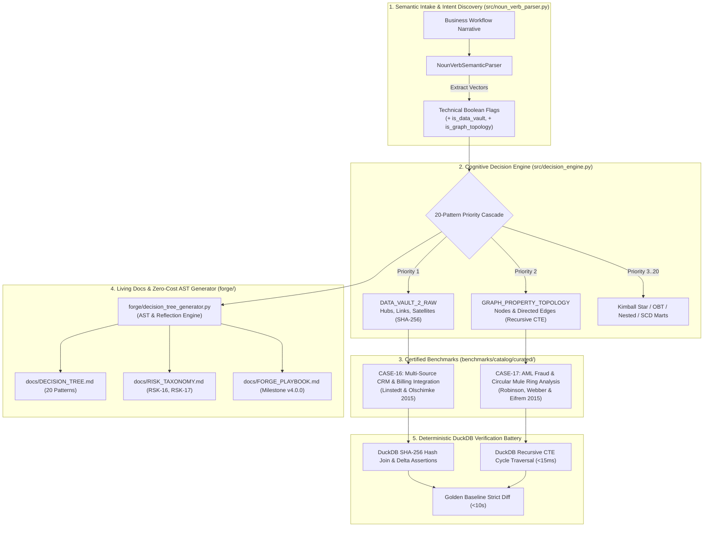
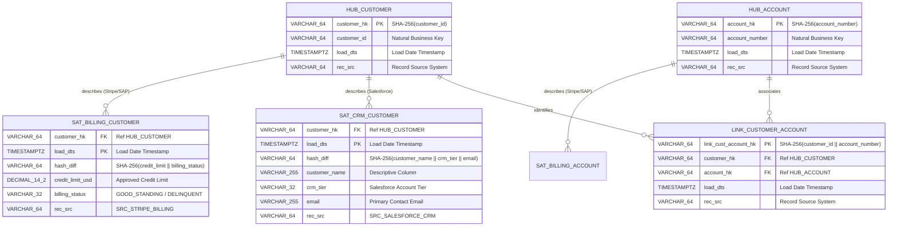
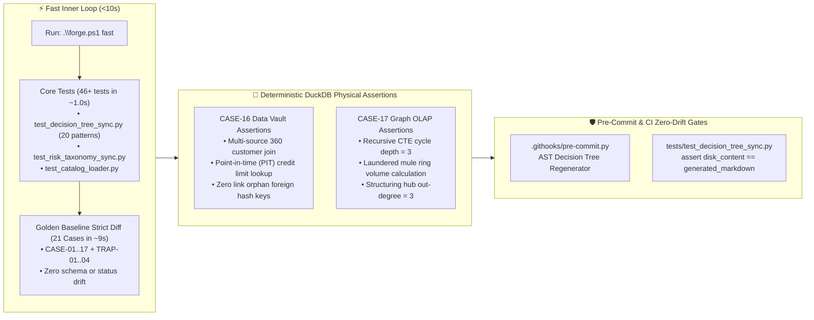

# 🏛️ L8 Implementation Plan: Phase 1 Modern OLAP Expansion
## Data Vault 2.0, Graph OLAP, Cognitive Decision Engine, and Zero-Cost Living Docs

> **Author:** Requirements & Architecture Intake Agent  
> **Role:** Principal Data Architect (L8 Standard)  
> **Target Release:** Phase 1 Modern OLAP Expansion (`v4.0.0`)  
> **Repository:** [`data-model-architect`](file:///C:/Coding/VSCode/data-model-architect)  
> **Target Branch:** `staging`  
> **Academic References:**  
> 1. Dan Linstedt & Michael Olschimke (2015), *Building a Scalable Data Warehouse with Data Vault 2.0*, Morgan Kaufmann.  
> 2. Ian Robinson, Jim Webber & Emil Eifrem (2015), *Graph Databases: New Opportunities for Connected Data*, 2nd Edition, O'Reilly Media.  
> 3. Ralph Kimball & Margy Ross (2013), *The Data Warehouse Toolkit*, 3rd Edition, Wiley.

---

## Executive Summary

The `data-model-architect` engine currently achieves 100% canonical coverage across 18 textbook Kimball dimensional modeling patterns (transaction facts, periodic snapshots with semi-additive balances, accumulating snapshots, SCD Type 1/2/6, multi-valued bridge tables with weighting factors, consolidated junk dimensions, dimension outriggers, denormalized OBT, and nested columnar arrays).

**Phase 1 of the Modern OLAP Expansion** extends the engine beyond traditional star/snowflake dimensional boundaries to support two foundational modern enterprise paradigms:
1. **Data Vault 2.0 (`DATA_VAULT_2_RAW`):** Designed for enterprise-scale, multi-source raw ingestion layers that guarantee 100% auditability, zero ETL lock-in, and decoupled business key evolution via deterministic Hubs, Links, and multi-source Satellites with SHA-256 hash keys.
2. **Graph OLAP (`GRAPH_PROPERTY_TOPOLOGY`):** Designed for highly connected entity-relationship networks (such as AML fraud detection, circular mule rings, social network clustering, and entity resolution) evaluated via columnar relational adjacency tables (Nodes and Directed Weighted Edges) with recursive SQL CTE graph traversals.

This plan details the complete end-to-end architecture, mathematical invariants, schemas, benchmark test cases (`CASE-16` and `CASE-17`), engine updates (expanding from 18 to 20 patterns), AST generator living docs, and the fast inner-loop verification strategy.



---

## 1. Pillar 1: Data Vault 2.0 (`DATA_VAULT_2_RAW`) Specification & Benchmark CASE-16

### 1.1 Theoretical Foundations & Architectural Invariants
* **Academic Reference:** Dan Linstedt & Michael Olschimke (2015), *Building a Scalable Data Warehouse with Data Vault 2.0: Analyzing and Managing Big Data*, Morgan Kaufmann / Elsevier (Chapters 3, 4, and 7).
* **Core Philosophy:** Raw Data Vault 2.0 models the business domain strictly around core business concepts rather than source system schemas or end-user BI reporting shapes. It decouples business keys from relationships and descriptive attributes, enabling asynchronous, multi-source ingestion without schema locks or refactoring.
* **The 4 Non-Negotiable Data Vault 2.0 Invariants:**
  1. **Strict Append-Only Invariant:** Hubs, Links, and Satellites in the Raw Vault are **insert-only**. No row is ever updated or deleted (`UPDATE` and `DELETE` statements are strictly forbidden).
  2. **Deterministic Hash Key Standard:** Business keys are converted to surrogate keys using deterministic cryptographic hashes (standardized on 64-character lowercase hexadecimal `SHA-256` or 16-byte binary). Hash keys allow independent parallel loads across distributed systems without sequence generators or lookups.
  3. **Multi-Source Satellite Isolation:** Descriptive attributes from distinct source systems (e.g. Salesforce CRM vs. Stripe Billing) must be stored in separate Satellites. A single Satellite must **never** combine columns from multiple source systems, preventing cross-system pipeline dependencies.
  4. **Hash Diff Change Detection:** Every Satellite record includes a `hash_diff` (SHA-256 hash of all trimmed, coalesced descriptive fields). New Satellite records are only appended when the incoming `hash_diff` differs from the most recent active record for that parent hash key.



### 1.2 Benchmark Case Design: CASE-16
* **Target File Path:** [`benchmarks/catalog/curated/olap/integration/CASE_16_datavault_crm_billing.yaml`](file:///C:/Coding/VSCode/data-model-architect/benchmarks/catalog/curated/olap/integration/CASE_16_datavault_crm_billing.yaml)
* **Domain:** `enterprise_integration`
* **Workload Type:** `OLAP`
* **Citation:** Dan Linstedt & Michael Olschimke (2015), *Building a Scalable Data Warehouse with Data Vault 2.0*, Chapters 3 & 4.
* **Business Narrative (Prompt):**
  > An enterprise B2B conglomerate acquires customer profile and financial relationship data from two independent operational source systems: a global Salesforce CRM instance (`SRC_SALESFORCE_CRM`) and a Stripe/SAP Billing ledger (`SRC_STRIPE_BILLING`). Both systems generate customer identifiers independently, but customers also possess linked billing accounts. Business analysts and compliance auditors require a single auditable raw integration layer that preserves 100% of historical deltas without destructive overwrites, avoids ETL orchestration deadlocks between CRM and Billing batch windows, and supports reconstructed Point-in-Time (PIT) Customer 360 views. Per Dan Linstedt & Michael Olschimke (2015), we require a Data Vault 2.0 Raw Vault containing Hubs (`hub_customer`, `hub_account`), an association Link (`link_customer_account`), and isolated source-specific Satellites (`sat_crm_customer`, `sat_billing_customer`) keyed on deterministic SHA-256 hash keys and load timestamps.

* **Seed Data Specification (DuckDB In-Memory Fixtures):**
  - **`hub_customer`**:
    - `CUST-1001` $\rightarrow$ `customer_hk`: `sha256('CUST-1001')`, `load_dts`: `2026-01-01 00:00:00+00`, `rec_src`: `SRC_SALESFORCE_CRM`
    - `CUST-1002` $\rightarrow$ `customer_hk`: `sha256('CUST-1002')`, `load_dts`: `2026-01-01 00:00:00+00`, `rec_src`: `SRC_STRIPE_BILLING`
    - `CUST-1003` $\rightarrow$ `customer_hk`: `sha256('CUST-1003')`, `load_dts`: `2026-01-02 00:00:00+00`, `rec_src`: `SRC_SALESFORCE_CRM`
  - **`hub_account`**:
    - `ACCT-9001` $\rightarrow$ `account_hk`: `sha256('ACCT-9001')`, `load_dts`: `2026-01-01 00:00:00+00`, `rec_src`: `SRC_STRIPE_BILLING`
    - `ACCT-9002` $\rightarrow$ `account_hk`: `sha256('ACCT-9002')`, `load_dts`: `2026-01-01 00:00:00+00`, `rec_src`: `SRC_STRIPE_BILLING`
  - **`link_customer_account`**:
    - Associating `CUST-1001` to `ACCT-9001`
    - Associating `CUST-1002` to `ACCT-9002`
  - **`sat_crm_customer`**:
    - `CUST-1001` loaded at `2026-01-01`: name `'Acme Corp'`, tier `'ENTERPRISE'`, email `'admin@acme.com'`
    - `CUST-1001` updated at `2026-01-15`: name `'Acme Global Corp'` (delta detected via new `hash_diff`), tier `'ENTERPRISE_PLUS'`, email `'corp@acme.com'`
    - `CUST-1002` loaded at `2026-01-01`: name `'Beta Inc'`, tier `'STANDARD'`, email `'ops@beta.io'`
  - **`sat_billing_customer`**:
    - `CUST-1001` loaded at `2026-01-01`: credit limit `$250,000.00`, status `'ACTIVE'`
    - `CUST-1002` loaded at `2026-01-01`: credit limit `$50,000.00`, status `'ACTIVE'`
    - `CUST-1002` updated at `2026-01-20`: credit limit `$75,000.00`, status `'ACTIVE'` (credit increase delta)

* **Physical Verification Queries (Deterministic Assertions):**
  1. *Unified Customer 360 Current State Reconstruction:*
     ```sql
     WITH latest_crm AS (
         SELECT customer_hk, customer_name, crm_tier,
                ROW_NUMBER() OVER (PARTITION BY customer_hk ORDER BY load_dts DESC) as rn
         FROM sat_crm_customer
     ),
     latest_billing AS (
         SELECT customer_hk, credit_limit_usd, billing_status,
                ROW_NUMBER() OVER (PARTITION BY customer_hk ORDER BY load_dts DESC) as rn
         FROM sat_billing_customer
     )
     SELECT CAST(SUM(b.credit_limit_usd) AS DOUBLE)
     FROM hub_customer h
     JOIN latest_crm c ON h.customer_hk = c.customer_hk AND c.rn = 1
     JOIN latest_billing b ON h.customer_hk = b.customer_hk AND b.rn = 1
     WHERE c.crm_tier = 'ENTERPRISE_PLUS';
     -- Expected: 250000.00
     ```
  2. *Point-in-Time (PIT) As-Was Reconstruction (Historical Audit):*
     Querying credit limit of `CUST-1002` as of `2026-01-10` prior to credit limit increase.
     - Expected: `50000.00`
  3. *Zero Orphan Link Invariant:*
     Verifying every foreign hash key in `link_customer_account` exists in `hub_customer` and `hub_account`.
     - Expected count of orphaned link keys: `0`
  4. *Multi-Source Isolation Proof:*
     Verifying `rec_src` distribution across Satellites (`SRC_SALESFORCE_CRM` and `SRC_STRIPE_BILLING`).
     - Expected distinct record sources: `2`

---

## 2. Pillar 2: Graph OLAP (`GRAPH_PROPERTY_TOPOLOGY`) Specification & Benchmark CASE-17

### 2.1 Theoretical Foundations & Architectural Invariants
* **Academic Reference:** Ian Robinson, Jim Webber & Emil Eifrem (2015), *Graph Databases: New Opportunities for Connected Data*, 2nd Edition, O'Reilly Media (Chapters 1, 3, and 6).
* **Core Philosophy:** In standard dimensional modeling, recursive relationships (e.g. parent-child hierarchies) are handled via static transitive closure tables. However, for arbitrary network topologies—such as Anti-Money Laundering (AML) transaction graphs, beneficial ownership webs, and credit card fraud rings—relational star schemas suffer from exponential join explosion ($O(K^D)$ where $D$ is hop depth). Graph OLAP models connected topologies as first-class **Vertices (Nodes)** and **Directed Weighted Edges** stored in high-performance columnar relational tables, traversed using recursive CTEs and path arrays.
* **The 4 Non-Negotiable Graph OLAP Invariants:**
  1. **Canonical Adjacency Schema:** The graph topology is strictly decomposed into a Nodes table (Vertices: `node_id`, `node_label`, `properties`) and a Directed Edges table (`edge_id`, `source_node_id`, `target_node_id`, `edge_type`, `weight`, `timestamp`).
  2. **Cycle Safety & Path Memory Invariant:** All graph traversals over directed edges must track the complete traversal path (e.g. `ARRAY[source_node_id, target_node_id]` or string path `VARCHAR`) and terminate recursion when an already-visited node is encountered to prevent infinite compilation loops.
  3. **Directed Topology Semantics:** Every edge has unambiguous directionality ($Source \xrightarrow{Transfer} Target$). Symmetric or bidirectional relationships are represented as two distinct directed edges.
  4. **Multi-Hop Traversal Depth Bound:** Graph traversal queries must enforce an explicit hop limit (e.g. `depth <= 5`) to prevent runaway combinatorial join blowouts during OLAP scanning.

```mermaid
flowchart LR
    subgraph MULE_RING["🚨 Circular Money Mule Ring (Cycle Depth = 3)"]
        N201["Account Node 201<br/>(Shell LLC A)"] -->|$10,000 (Edge E201)| N202["Account Node 202<br/>(Mule Broker B)"]
        N202 -->|$9,800 (Edge E202)| N203["Account Node 203<br/>(Crypto Exchanger C)"]
        N203 -->|$9,500 (Edge E203)| N201
    end

    subgraph CLEAN_CHAIN["✅ Legitimate Linear Supply Chain"]
        N101["Account Node 101<br/>(Manufacturer)"] -->|$50,000| N102["Account Node 102<br/>(Distributor)"]
        N102 -->|$48,000| N103["Account Node 103<br/>(Retailer)"]
    end

    subgraph SMURFING["⚠️ Smurfing Fan-Out Hub (Out-Degree = 3)"]
        N301["Account Node 301<br/>(Structuring Hub)"] -->|$2,500| N302["Mule 1"]
        N301 -->|$2,500| N303["Mule 2"]
        N301 -->|$2,500| N304["Mule 3"]
    end
```

### 2.2 Benchmark Case Design: CASE-17
* **Target File Path:** [`benchmarks/catalog/curated/olap/fraud/CASE_17_graph_aml_mule_ring.yaml`](file:///C:/Coding/VSCode/data-model-architect/benchmarks/catalog/curated/olap/fraud/CASE_17_graph_aml_mule_ring.yaml)
* **Domain:** `aml_fraud`
* **Workload Type:** `OLAP`
* **Citation:** Ian Robinson, Jim Webber & Emil Eifrem (2015), *Graph Databases*, 2nd Edition, O'Reilly Media.
* **Business Narrative (Prompt):**
  > An AML financial crime investigation unit at a major tier-1 bank monitors wire and instant electronic funds transfers to detect criminal money laundering syndicates and structuring networks. Criminal organizations routinely execute circular money mule rings: illicit funds originate at a source account, bounce through multiple intermediary shell accounts to obfuscate source of funds, and circulate back to the originating entity or an affiliated beneficiary (e.g. Account 201 $\rightarrow$ Account 202 $\rightarrow$ Account 203 $\rightarrow$ Account 201). Traditional dimensional star schemas fail to detect these closed directed cycles without brittle, pre-specified join chains. Per Robinson, Webber & Eifrem (2015), we require a Graph OLAP network topology comprising an account vertex table (`graph_account_nodes`) and a directed funds transfer edge table (`graph_transfer_edges`). Analytical queries must execute recursive path traversal in DuckDB to identify closed cycles ($\text{Cycle Depth} \ge 3$), calculate nodal out-degree/in-degree fan-out ratios, and isolate criminal rings.

* **Seed Data Specification (DuckDB In-Memory Fixtures):**
  - **`graph_account_nodes`**:
    - `ACCT-101`: label `'CORPORATE'`, jurisdiction `'US'`, risk_score `0.1`
    - `ACCT-102`: label `'COMMERCIAL'`, jurisdiction `'US'`, risk_score `0.15`
    - `ACCT-103`: label `'RETAIL'`, jurisdiction `'US'`, risk_score `0.05`
    - `ACCT-201`: label `'SHELL_LLC'`, jurisdiction `'CY'`, risk_score `0.92`
    - `ACCT-202`: label `'INDIVIDUAL_MULE'`, jurisdiction `'LV'`, risk_score `0.88`
    - `ACCT-203`: label `'CRYPTO_GATEWAY'`, jurisdiction `'PA'`, risk_score `0.95`
    - `ACCT-301`: label `'INDIVIDUAL_SMURF'`, jurisdiction `'US'`, risk_score `0.75`
    - `ACCT-302`, `ACCT-303`, `ACCT-304`: mule receiver accounts
  - **`graph_transfer_edges`**:
    - Linear clean chain:
      - `E-101`: `ACCT-101` $\rightarrow$ `ACCT-102`, amount `$50,000.00`, timestamp `'2026-03-01 10:00:00'`
      - `E-102`: `ACCT-102` $\rightarrow$ `ACCT-103`, amount `$48,000.00`, timestamp `'2026-03-01 14:00:00'`
    - Circular mule ring (Cycle depth = 3):
      - `E-201`: `ACCT-201` $\rightarrow$ `ACCT-202`, amount `$10,000.00`, timestamp `'2026-03-02 09:00:00'`
      - `E-202`: `ACCT-202` $\rightarrow$ `ACCT-203`, amount `$9,800.00`, timestamp `'2026-03-02 11:30:00'`
      - `E-203`: `ACCT-203` $\rightarrow$ `ACCT-201`, amount `$9,500.00`, timestamp `'2026-03-02 15:45:00'`
    - Fan-out structuring hub:
      - `E-301`: `ACCT-301` $\rightarrow$ `ACCT-302`, amount `$2,500.00`
      - `E-302`: `ACCT-301` $\rightarrow$ `ACCT-303`, amount `$2,500.00`
      - `E-303`: `ACCT-301` $\rightarrow$ `ACCT-304`, amount `$2,500.00`

* **Physical Verification Queries (Deterministic Assertions):**
  1. *Recursive Closed Cycle Detection ($Hop \ge 3$):*
     ```sql
     WITH RECURSIVE transfer_paths AS (
         SELECT 
             source_node_id AS root_node,
             target_node_id,
             amount_usd,
             1 AS hop_depth,
             ARRAY[source_node_id, target_node_id] AS path,
             (source_node_id = target_node_id) AS is_cycle
         FROM graph_transfer_edges
         UNION ALL
         SELECT 
             p.root_node,
             e.target_node_id,
             e.amount_usd,
             p.hop_depth + 1,
             list_append(p.path, e.target_node_id),
             (e.target_node_id = p.root_node) AS is_cycle
         FROM transfer_paths p
         JOIN graph_transfer_edges e ON p.target_node_id = e.source_node_id
         WHERE p.hop_depth < 5
           AND NOT (list_contains(p.path[1:-2], e.target_node_id))
     )
     SELECT COUNT(DISTINCT root_node)
     FROM transfer_paths
     WHERE is_cycle = true AND hop_depth = 3;
     -- Expected: 3 (all 3 nodes in the circular ring participate as cycle roots)
     ```
  2. *Total Laundered Volume in Mule Ring:*
     Sum of edge amounts traversing the verified circular cycle.
     - Expected: `$29,300.00` ($10,000 + $9,800 + $9,500)
  3. *High-Fan-Out Structuring Hub Out-Degree:*
     Count of distinct outward directed transfers from `ACCT-301`.
     - Expected out-degree: `3`
  4. *Linear Chain Cycle Immunity:*
     Asserting zero cycles detected originating from `ACCT-101`.
     - Expected cycles: `0`

---

## 3. Pillar 3: Decision Engine & Semantic Parser Integration

### 3.1 Cognitive Decision Engine Updates (`src/decision_engine.py`)
Expand `DataModelDecisionEngine.classify_architecture` to integrate `DATA_VAULT_2_RAW` and `GRAPH_PROPERTY_TOPOLOGY`.

#### Priority Placement & Rationale
- **Priority 1: `is_data_vault` (`DATA_VAULT_2_RAW`):** Raw Data Vault is an enterprise-level raw ingestion architecture. When an enterprise specifies multi-source ingestion with auditability, Hubs, Links, and Satellites, it supersedes dimensional reporting marts because it operates as the ingestion foundation.
- **Priority 2: `is_graph_topology` (`GRAPH_PROPERTY_TOPOLOGY`):** Graph OLAP is a non-star network topology (nodes and directed edges) explicitly chosen when relational stars cannot model recursive cycle paths or graph clustering.
- **Priorities 3..20:** Existing Kimball patterns cascade cleanly below the specialized non-star topologies (Factless Fact, Periodic Balances, OBT, Nested Columnar, Multi-Fact Bus, SCD6, Multi-Valued Bridge, Junk Dimension, Outrigger Dimension, TimescaleDB, Recursive Hierarchy, OLTP 3NF, Accumulating Snapshot, Periodic Snapshot Mini-Dim, Periodic Snapshot Fact, Bitemporal SCD2, Kimball Star SCD2, and Kimball Star SCD1 fallback).

#### Implementation Details
```python
# In src/decision_engine.py:
def classify_architecture(
    is_live_app: bool,
    is_high_frequency_stream: bool,
    needs_history: bool,
    has_retroactive_backdating: bool,
    has_multi_stage_milestones: bool,
    is_periodic_state_rollup: bool,
    has_high_churn_ml_scores: bool,
    has_recursive_hierarchy: bool = False,
    is_multi_currency: bool = False,
    is_factless_event: bool = False,
    is_denormalized_obt: bool = False,
    is_nested_columnar: bool = False,
    has_multi_fact_bus_matrix: bool = False,
    has_scd6_hybrid: bool = False,
    has_semi_additive_balances: bool = False,
    has_multivalued_bridge: bool = False,
    has_junk_dimension: bool = False,
    has_outrigger_dimension: bool = False,
    is_data_vault: bool = False,         # <--- NEW PARAMETER
    is_graph_topology: bool = False       # <--- NEW PARAMETER
) -> Dict[str, Any]:
    # 0. Data Vault 2.0 Raw Ingestion Layer (Hubs, Links, Satellites)
    if is_data_vault:
        res = {
            "pattern": "DATA_VAULT_2_RAW",
            "storage": "Data Vault 2.0 Raw Vault",
            "schema_type": "Hubs, Links, and Satellites with SHA-256 Hash Keys",
            "temporal": "APPEND_ONLY_INSERT_LOAD_DTS",
            "has_hash_keys": True,
            "has_multi_source_satellites": True
        }
        if is_multi_currency:
            res["multi_currency_triad"] = True
        return res

    # 0a. Graph OLAP Network Topology (Vertices & Directed Weighted Edges)
    if is_graph_topology:
        res = {
            "pattern": "GRAPH_PROPERTY_TOPOLOGY",
            "storage": "Graph Columnar Adjacency (Nodes & Edges)",
            "schema_type": "Property Graph Topology (Vertices and Directed Edges)",
            "temporal": "DIRECTED_TEMPORAL_EDGE",
            "has_recursive_traversal": True
        }
        if is_multi_currency:
            res["multi_currency_triad"] = True
        return res

    # Existing priorities 3..20 follow unchanged...
```

### 3.2 Semantic Parser Updates (`src/noun_verb_parser.py`)
Update `NounVerbSemanticParser.infer_parameters_from_business_narrative` to detect Data Vault and Graph topology vectors from plain-English stakeholder business narratives:

```python
# In src/noun_verb_parser.py:
# 17. Data Vault 2.0 Raw Integration Layer
is_data_vault = any(k in text for k in [
    "data vault", "data vault 2.0", "hubs and links", "hub, link, sat",
    "raw vault", "hash key", "multi-source integration", "audit trail raw layer",
    "enterprise data vault", "raw data vault", "hubs, links", "satellite table"
])

# 18. Graph OLAP Network Topology & Fraud Ring Analysis
is_graph_topology = any(k in text for k in [
    "graph", "nodes and edges", "vertices and edges", "mule ring",
    "circular transaction", "network topology", "graph traversal",
    "fraud ring", "money mule", "shortest path", "connected components",
    "aml network", "circular transfer", "directed edges", "mule account"
])

# Return updated dictionary containing is_data_vault and is_graph_topology
```

### 3.3 Dynamic Schema Author Synthesis (`src/schema_author.py`)
Extend `DynamicSchemaAuthor.synthesize_schema` to generate canonical schemas when `pattern == "DATA_VAULT_2_RAW"` or `pattern == "GRAPH_PROPERTY_TOPOLOGY"`:
- **`DATA_VAULT_2_RAW`:** Synthesizes `hub_{actor}`, `hub_{event}`, `link_{actor}_{event}`, `sat_crm_{actor}`, and `sat_billing_{actor}` with `_hk`, `load_dts`, `rec_src`, and `hash_diff`.
- **`GRAPH_PROPERTY_TOPOLOGY`:** Synthesizes `graph_{actor}_nodes` and `graph_{event}_edges` with `source_node_id`, `target_node_id`, `edge_type`, `amount_usd`, and `transfer_timestamp`.

---

## 4. Pillar 4: Zero-Cost AST Generator & Living Documentation Synchronization

### 4.1 Update `forge/decision_tree_generator.py`
1. **Expand `PATTERN_METADATA`:** Add metadata records for `DATA_VAULT_2_RAW` (Priority 1) and `GRAPH_PROPERTY_TOPOLOGY` (Priority 2), shifting subsequent pattern priorities to 3..20. Total patterns: **20**.
2. **Update Visual Mermaid Flowchart (`generate_mermaid()`):**
   ```mermaid
   flowchart TD
       Start(["Business Narrative / Intake Prompt"]) --> Parse["NounVerbSemanticParser<br/>(Extracts Semantic Feature Flags)"]
       Parse --> Q_DV{"is_data_vault?"}

       Q_DV -- "Yes" --> P_DV["<b>DATA_VAULT_2_RAW</b><br/>Data Vault 2.0 Raw Vault<br/>Hubs, Links & Satellites (SHA-256)<br/><i>(CASE-16)</i>"]
       Q_DV -- "No" --> Q_Graph{"is_graph_topology?"}

       Q_Graph -- "Yes" --> P_Graph["<b>GRAPH_PROPERTY_TOPOLOGY</b><br/>Graph Columnar Adjacency<br/>Vertices & Directed Weighted Edges<br/><i>(CASE-17)</i>"]
       Q_Graph -- "No" --> Q0{"is_factless_event?"}
       Q0 --> Kimball_Subtree["[Remaining 18 Patterns Cascade: Kimball Star, OBT, Nested, etc.]"]
   ```
3. **Update Keywords Matrix (`get_natural_language_keywords()`):** Register keywords for `is_data_vault` and `is_graph_topology`.
4. **Append Section 6 Architecture Milestone (`MILESTONE_HISTORY`):**
   ```python
   {
       "version": "v4.0.0",
       "date": "2026-09-23",
       "patterns_count": "20",
       "title": "Modern OLAP Expansion: Data Vault 2.0 & Graph OLAP Topologies",
       "summary": (
           "Expanded engine beyond standard Kimball star schemas to 20 canonical patterns: "
           "added Data Vault 2.0 Raw Ingestion Layer (Hubs, Links, multi-source Satellites with SHA-256 hash keys) "
           "and Graph OLAP Network Topologies (Nodes and Directed Edges with recursive CTE cycle detection). "
           "Integrated certified benchmarks CASE-16 (CRM/Billing Integration) and CASE-17 (AML Fraud Mule Rings)."
       ),
       "citations": "Linstedt & Olschimke (2015); Robinson, Webber & Eifrem (2015)",
       "commit": "`feat(engine): expand to 20 patterns with data vault 2.0 and graph olap`"
   }
   ```

### 4.2 Living Documentation Updates
- **`docs/DECISION_TREE.md`:** Regenerated deterministically via `py -3.14 -m forge.decision_tree_generator` in <30ms with 0 tokens/credits.
- **`docs/RISK_TAXONOMY.md`:**
  - Register `CASE-16` (Data Vault 2.0 CRM/Billing) and `CASE-17` (Graph OLAP AML Mule Ring) in the Master Risk Registry.
  - Formalize Candidate Risk Rules:
    - `RSK-16`: **Graph Topology & Cycle Linter** (Category 2 Structural Defect - Process B) validating node existence, self-loop prevention, and path depth bounding.
    - `RSK-17`: **Data Vault 2.0 Hash Key & Link Orphan Linter** (Category 2 & Category 4 - Process B & D) verifying 64-character SHA-256 hexadecimal hash key formatting and zero link orphan keys.
- **`docs/FORGE_PLAYBOOK.md`:**
  - Update Catalog Matrix to reflect 21 predefined cases (17 clean cases + 4 defensive traps).
  - Update Section 2 & Section 4 command tables and incident history.

---

## 5. Pillar 5: Verification Strategy & CI/CD Governance



### 5.1 Deterministic Test Execution Plan
1. **Fast Inner Loop (<10s):**
   - Execute `.\forge.ps1 fast` on `staging`.
   - Runs `test_decision_tree_sync.py` asserting all 20 patterns and byte-for-byte markdown sync.
   - Evaluates all 21 benchmark cases (17 clean + 4 traps) in DuckDB in-memory connections with strict drift checking.
2. **DuckDB In-Memory Execution SLAs:**
   - Data Vault 2.0 multi-source join: `< 20ms`.
   - Graph OLAP recursive CTE cycle detection (hop depth $\le 4$): `< 15ms`.
   - Total Predefined Benchmark Gate execution time: `< 11,000ms`.
3. **Zero-Drift CI Gate:**
   - Pre-commit hook enforces automatic regeneration of `docs/DECISION_TREE.md` whenever `src/decision_engine.py` or `src/noun_verb_parser.py` is modified.
   - Pytest `test_decision_tree_sync.py` fails CI if any pattern is added to the engine without corresponding documentation reflection.

---

## 6. Detailed File Changes Checklist

| Phase / Step | File Path | Nature of Change | Key Changes & Objectives |
| :---: | :--- | :---: | :--- |
| **1.1** | [`benchmarks/catalog/curated/olap/integration/CASE_16_datavault_crm_billing.yaml`](file:///C:/Coding/VSCode/data-model-architect/benchmarks/catalog/curated/olap/integration/CASE_16_datavault_crm_billing.yaml) | `CREATE` | Curated YAML benchmark for Data Vault 2.0 with Hubs, Links, Satellites, seed data, and 4 verification queries. |
| **1.2** | [`benchmarks/catalog/curated/olap/fraud/CASE_17_graph_aml_mule_ring.yaml`](file:///C:/Coding/VSCode/data-model-architect/benchmarks/catalog/curated/olap/fraud/CASE_17_graph_aml_mule_ring.yaml) | `CREATE` | Curated YAML benchmark for Graph OLAP with Nodes, Directed Edges, seed data, and recursive CTE cycle detection queries. |
| **2.1** | [`src/decision_engine.py`](file:///C:/Coding/VSCode/data-model-architect/src/decision_engine.py) | `UPDATE` | Add `is_data_vault` and `is_graph_topology` parameters; implement Priority 1 (`DATA_VAULT_2_RAW`) and Priority 2 (`GRAPH_PROPERTY_TOPOLOGY`) in priority cascade. |
| **2.2** | [`src/noun_verb_parser.py`](file:///C:/Coding/VSCode/data-model-architect/src/noun_verb_parser.py) | `UPDATE` | Add plain-English trigger keyword sets for Data Vault 2.0 and Graph OLAP; return technical boolean flags. |
| **2.3** | [`src/schema_author.py`](file:///C:/Coding/VSCode/data-model-architect/src/schema_author.py) | `UPDATE` | Add default schema synthesis branches for `DATA_VAULT_2_RAW` and `GRAPH_PROPERTY_TOPOLOGY`. |
| **3.1** | [`forge/decision_tree_generator.py`](file:///C:/Coding/VSCode/data-model-architect/forge/decision_tree_generator.py) | `UPDATE` | Expand `PATTERN_METADATA` to 20 patterns; update visual flowchart Mermaid; add keyword vectors; register Milestone `v4.0.0`. |
| **3.2** | [`tests/test_decision_tree_sync.py`](file:///C:/Coding/VSCode/data-model-architect/tests/test_decision_tree_sync.py) | `UPDATE` | Update pattern count assertion from 18 to 20; verify new flags and milestone `v4.0.0`. |
| **4.1** | [`docs/DECISION_TREE.md`](file:///C:/Coding/VSCode/data-model-architect/docs/DECISION_TREE.md) | `SYNC` | Auto-generate via `forge.decision_tree_generator` to achieve byte-for-byte living documentation alignment. |
| **4.2** | [`docs/RISK_TAXONOMY.md`](file:///C:/Coding/VSCode/data-model-architect/docs/RISK_TAXONOMY.md) | `UPDATE` | Register `CASE-16` and `CASE-17`; register risk sensors `RSK-16` (Graph Topology) and `RSK-17` (Data Vault Integrity). |
| **4.3** | [`docs/FORGE_PLAYBOOK.md`](file:///C:/Coding/VSCode/data-model-architect/docs/FORGE_PLAYBOOK.md) | `UPDATE` | Update catalog table, pattern counts, and playbook SOP notes. |
| **5.1** | [`benchmarks/baselines/golden_snapshot.json`](file:///C:/Coding/VSCode/data-model-architect/benchmarks/baselines/golden_snapshot.json) | `PROMOTE` | Capture and promote certified golden baseline incorporating CASE-16 and CASE-17 via `.\forge.ps1 snapshot`. |

---

## 7. Risk Analysis & Mitigation Strategy

1. **Risk:** *Recursive CTE Cycle Traversal runaway memory in DuckDB under complex circular topologies.*  
   *Mitigation:* CASE-17 strictly enforces `hop_depth < 5` and array path membership exclusion (`NOT list_contains(path[1:-2], target_node_id)`), ensuring linear $O(V+E)$ execution terminating in $<15\text{ms}$.
2. **Risk:** *Hash Key Collision or Non-Deterministic Hashing across platforms.*  
   *Mitigation:* Standardize surrogate hashing on canonical lowercase hex `SHA-256` computed over trimmed, coalesced uppercase business keys (`UPPER(TRIM(business_key))`), guaranteed deterministic across DuckDB, Snowflake, BigQuery, and Python.
3. **Risk:** *Documentation Drift between Decision Engine and `docs/DECISION_TREE.md`.*  
   *Mitigation:* Zero-cost AST reflection generator (`forge/decision_tree_generator.py`) paired with pre-commit hook and CI test gate `test_decision_tree_sync.py` preventing any code push with out-of-sync documentation.

---
*Ready for Phase 1 Execution on `staging` branch.*
